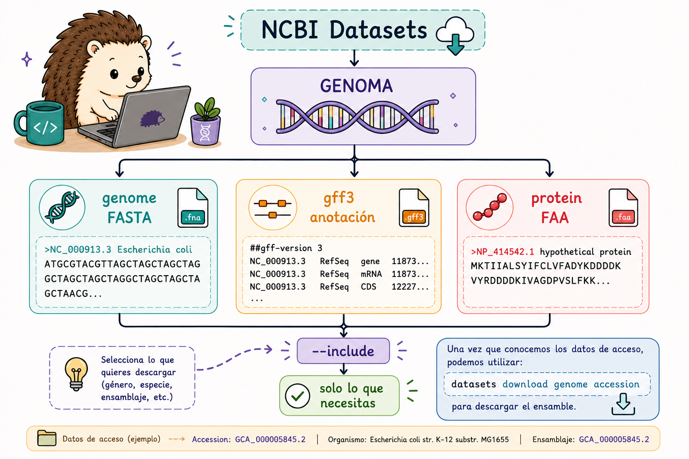
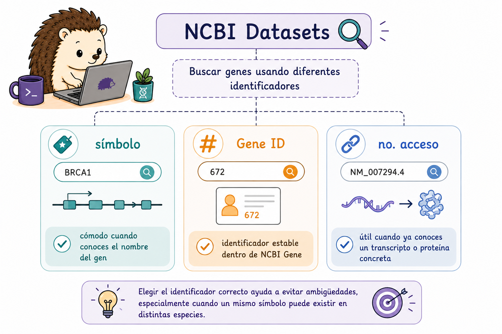
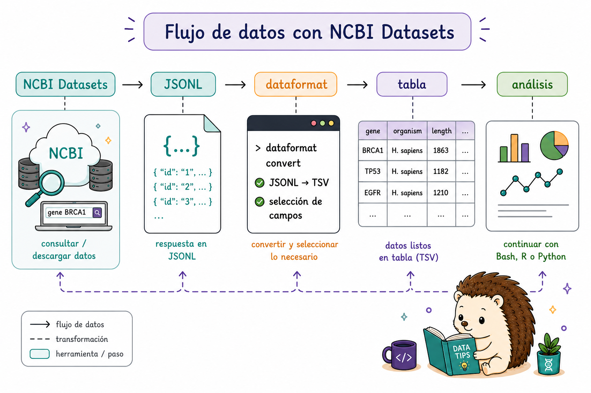

`E-utilities` y `NCBI Datasets` son herramientas complementarias.

-   **E-utilities** son especialmente útiles para buscar registros, recuperar información y navegar entre diferentes bases de datos.
-   **NCBI Datasets** está pensado para descargar conjuntos organizados de datos, como genomas, genes, proteínas, virus y sus metadatos.

NCBI Datasets está compuesto por dos herramientas principales:

| Herramienta  | Función                                         |
|--------------|-------------------------------------------------|
| `datasets`   | Descargar secuencias y metadatos de NCBI        |
| `dataformat` | Convertir metadatos de JSON Lines → TSV / Excel |

::: callout-tip
##  Datasets vs. E-utilities

Una forma sencilla de decidir cuál utilizar es pensar en la tarea:

**¿Quiero buscar o navegar entre registros?** → `E-utilities`

**¿Quiero descargar un conjunto organizado de datos?** → `NCBI Datasets`

No son herramientas que compitan entre sí. Muchas veces podemos utilizarlas en conjunto dentro de un mismo análisis.
:::

{fig-align="center" width="130%"}

## Instalación

La instalación de nuevo depende del sistema operativo. Si ya utilizas `conda`, esta suele ser la opción más sencilla porque instala `datasets` y `dataformat` juntos.

### Linux y macOS

``` bash
# Opción 1: conda (recomendada — instala datasets + dataformat juntos)
conda create -n ncbi_datasets
conda activate ncbi_datasets
conda install -c conda-forge ncbi-datasets-cli

# Opción 2: descarga directa con curl
# Linux (AMD64)
curl -o datasets \
  'https://ftp.ncbi.nlm.nih.gov/pub/datasets/command-line/v2/linux-amd64/datasets'
curl -o dataformat \
  'https://ftp.ncbi.nlm.nih.gov/pub/datasets/command-line/v2/linux-amd64/dataformat'
chmod +x datasets dataformat

# macOS (Universal)
curl -o datasets \
  'https://ftp.ncbi.nlm.nih.gov/pub/datasets/command-line/v2/mac/datasets'
curl -o dataformat \
  'https://ftp.ncbi.nlm.nih.gov/pub/datasets/command-line/v2/mac/dataformat'
chmod +x datasets dataformat

# Verificar
datasets --version
dataformat --version
```

### Windows - WSL

Dentro de la terminal Ubuntu de WSL, usar exactamente los mismos comandos que en Linux (sección anterior).

::: callout-note
## Documentación oficial

Toda la referencia de comandos para la instalación está en: <https://www.ncbi.nlm.nih.gov/datasets/docs/v2/command-line-tools/download-and-install/>
:::

## Descargar genomas por números de acceso

### Ensambles: `GCF_` y `GCA_`

Los ensambles genómicos se identifican mediante números de acceso.

-   `GCF_` corresponde a ensambles de **RefSeq**.
-   `GCA_` corresponde a ensambles de **GenBank**.

No siempre necesitamos todos los archivos asociados con un genoma. La opción `--include` permite seleccionar únicamente los componentes que necesitamos.

También es importante saber qué número de acceso estamos utilizando antes de descargarla, porque una misma especie puede tener varios ensambles.

Una vez que conocemos los datos de acceso, podemos utilizar `datasets download genome accession` para descargar el ensamble.

{fig-align="center" width="90%"}

``` bash
# ── Descarga básica de un genoma ──────────────────────────────────────────────

# Genoma humano hg38 (GRCh38.p14)
datasets download genome accession GCF_000001405.40 \
  --filename human_hg38.zip

# Ratón mm39
datasets download genome accession GCF_000001635.27 \
  --filename mouse_mm39.zip

# Zebrafish (pez cebra) GRCz11
datasets download genome accession GCF_000002035.6 \
  --filename zebrafish_GRCz11.zip

# ─ Incluir archivos adicionales con --include ─────────────────────────────────

# Opciones de --include: genome, gff3, gtf, rna, protein, cds, seq-report, none
datasets download genome accession GCF_000001405.40 \
  --include genome,gff3,protein \
  --filename hg38_completo.zip

# Solo la anotación (sin secuencia del genoma — mucho más pequeño)
datasets download genome accession GCF_000001405.40 \
  --include gff3,gtf \
  --filename hg38_anotacion.zip

# ── Descomprimir y explorar el paquete ────────────────────────────────────────

unzip human_hg38.zip -d human_hg38/
ls human_hg38/ncbi_dataset/data/GCF_000001405.40/
# Contenido típico:
#   GCF_000001405.40_GRCh38.p14_genomic.fna   ← FASTA del genoma
#   genomic.gff                                ← anotación GFF3
#   protein.faa                                ← proteínas (si se incluyó)
#   assembly_data_report.jsonl                 ← metadatos del ensamble

# ── Consultar metadatos sin descargar ─────────────────────────────────────────

datasets summary genome accession GCF_000001405.40
datasets summary genome accession GCF_000001405.40 --as-json-lines | head -1
```

Dependiendo de lo que hayas incluido, encontrarás archivos como:

-   FASTA del genoma;
-   GFF3 o GTF de anotaciones;
-   proteínas;
-   metadatos del ensamble.

### Consultar sin descargar

No siempre necesitamos descargar un archivo para conocer sus características.

`datasets summary` permite consultar información sobre un recurso sin descargar el paquete completo.

``` bash
datasets summary genome accession GCF_000001405.40
```

------------------------------------------------------------------------

::: panel-tabset
### Ejercicio 1:

**¿Cuál comando descarga el genoma humano hg38 junto con su anotación GFF3, pero SIN las secuencias de proteínas?**

a)  `datasets download genome accession GCF_000001405.40 --include all`\
b)  `datasets download genome accession GCF_000001405.40 --include genome,protein`\
c)  **`datasets download genome accession GCF_000001405.40 --include genome,gff3`**\
d)  `datasets download genome accession GCF_000001405.40`

### ✅ Solución

La respuesta correcta es **c)**.

-   **a)** `--include all` incluiría también proteínas, ARN y otros archivos
-   **b)** incluye proteínas pero no la anotación GFF3
-   **c)** ✅ solo genoma + anotación GFF3
-   **d)** descarga únicamente la secuencia del genoma (sin anotación)

Los valores posibles de `--include` son: `genome`, `gff3`, `gtf`, `rna`, `protein`, `cds`, `seq-report`, separados por comas.
:::

------------------------------------------------------------------------

## Descargar genes por número de acceso

NCBI Datasets permite buscar genes utilizando diferentes tipos de identificadores:

-   **symbol**: cómodo cuando conoces el nombre del gen;
-   **gene-id**: identificador estable dentro de NCBI Gene;
-   **no. acceso**: útil cuando ya conoces un transcripto o proteína concreta.

Ejemplo: `bash  datasets download gene symbol TP53 --taxon human`

También podemos utilizar `--include` para genes. Los valores disponibles de `gene`, `rna`, `protein`, `cds`, `5-utr`, `3-utr`, `flank`.

{fig-align="center" width="90%"}

``` bash
# Descargar el gen TP53 de Homo sapiens
datasets download gene symbol TP53 --taxon human

# Descargar el gen TP53 de Homo sapiens
datasets download gene symbol TP53 --taxon human

# Descargar un gen utilizando su Gene ID
datasets download gene gene-id 7157
```

------------------------------------------------------------------------

::: panel-tabset
### Ejercicio 2:

Completa el comando para descargar las secuencias de **ARNm y proteína** de los genes **APOE**, **TREM2** y **BIN1** en humanos:

``` bash
datasets download gene ___ APOE TREM2 BIN1 \
  --taxon ___ \
  --include ___ \
  --filename alzheimer_genes.zip
```

### ✅ Solución

``` bash
datasets download gene symbol APOE TREM2 BIN1 \
  --taxon human \
  --include rna,protein \
  --filename alzheimer_genes.zip
```

**Explicación:** se usa `symbol` para buscar por nombre del gen, `--taxon human` para la especie, y `--include rna,protein` para obtener ambos tipos de secuencia. Los valores disponibles de `--include` para genes son: `gene`, `rna`, `protein`, `cds`, `5-utr`, `3-utr`, `flank`.
:::

------------------------------------------------------------------------

## Descargar virus

La misma lógica que utilizamos para los genomas celulares puede aplicarse a colecciones virales.

Podemos buscar por taxón o por una accesión concreta y decidir qué componentes queremos descargar.

``` bash
# Todos los genomas de SARS-CoV-2
datasets download virus genome taxon "Severe acute respiratory syndrome coronavirus 2" \
  --filename SARS-CoV2_genomas.zip

# Genomas de influenza A (Alphainfluenzavirus)
datasets download virus genome taxon "Alphainfluenzavirus" \
  --filename influenzaA_genomas.zip

# Por número de accesión viral específico
datasets download virus genome accession NC_045512 \
  --filename SARS-CoV2_refseq.zip

# Incluir proteínas del virus
datasets download virus genome accession NC_045512 \
  --include genome,protein \
  --filename SARS-CoV2_completo.zip

# Resumen de metadatos de virus sin descargar
datasets summary virus genome taxon "Alphainfluenzavirus" --as-json-lines | head -5
```

## Descargas en lote desde una lista de accesiones

Hasta ahora hemos trabajado con una o varias accesiones directamente en el comando. Cuando tenemos muchas, es más práctico guardarlas en un archivo.

Un archivo como `accesiones.txt` permite separar **los datos que queremos procesar** de **la lógica del pipeline**.

Por ejemplo:

``` text
GCF_000001405.40
GCF_000001635.27
GCF_000002035.6
```

### Múltiples accesiones en un solo comando

``` bash
# Pasar varias accesiones directamente
datasets download genome accession \
  GCF_000001405.40 GCF_000001635.27 GCF_000002035.6 \
  --include genome,gff3 \
  --filename tres_genomas.zip

# Desde un archivo de texto (un accesión por línea)
# Contenido de accesiones.txt:
# GCF_000001405.40
# GCF_000001635.27
# GCF_000002035.6

datasets download genome accession \
  --inputfile accesiones.txt \
  --include genome,gff3 \
  --filename batch_genomas.zip
```

Cuando las descargas requieren pasos adicionales, como descomprimir, organizar archivos o registrar errores, podemos utilizar un script Bash.

### Script bash: descargar, descomprimir y organizar en paralelo

`while` permite procesar las entradas una por una; `GNU parallel` permite ejecutar varios trabajos simultáneamente.

#### `while`

``` bash
#!/bin/bash
# descargar_batch.sh
# Uso: bash descargar_batch.sh accesiones.txt

INPUT=${1:-accesiones.txt}
OUTDIR="./genomas"
mkdir -p "$OUTDIR"

while IFS= read -r acc; do
  [[ -z "$acc" || "$acc" == \#* ]] && continue   # saltar líneas vacías/comentarios
  echo "[$(date +%T)] Descargando $acc ..."
  datasets download genome accession "$acc" \
    --include genome,gff3 \
    --filename "${OUTDIR}/${acc}.zip"
  unzip -q "${OUTDIR}/${acc}.zip" -d "${OUTDIR}/${acc}/"
  rm "${OUTDIR}/${acc}.zip"
  echo "  ✓ $acc completado"
done < "$INPUT"

echo "Todos los genomas descargados en $OUTDIR/"
```

#### GNU `parallel`

``` bash
# Descargar 3 genomas simultáneamente
cat accesiones.txt | parallel -j3 \
  "datasets download genome accession {} \
   --include genome,gff3 \
   --filename {}.zip && unzip -q {}.zip -d {}/ && rm {}.zip"
```

------------------------------------------------------------------------

::: panel-tabset
### Ejercicio 3:

Tienes el archivo `mis_organismos.txt` con estos accesiones:

```         
GCF_000001405.40   
GCF_000001635.27   
GCF_000005845.2
GCF_000009045.1
```
::: {.callout-note} 
GCF_000001405.40 → Homo sapiens
GCF_000001635.27 → Mus musculus
GCF_000005845.2  → E. coli K-12
GCF_000009045.1  → B. subtilis 168
:::

Escribe un pipeline que: 1. Descargue solo las anotaciones GFF3 (sin el genoma completo) de los 4 organismos 2. Descomprima cada `.zip` 3. Genere una tabla con el número de genes anotados en cada uno

### ✅ Solución

``` bash
#!/bin/bash
mkdir -p anotaciones

# 1. Descargar solo GFF3 en lote
datasets download genome accession \
  --inputfile mis_organismos.txt \
  --include gff3 \
  --filename batch_gff3.zip

unzip -q batch_gff3.zip -d anotaciones/

# 2. Contar genes en cada GFF3
echo -e "Organismo\tGFF3\tNum_genes" > tabla_genes.tsv

find anotaciones/ -name "*.gff" -o -name "*.gff3" | while read gff; do
  acc=$(echo "$gff" | grep -oP 'GCF_\d+\.\d+')
  num_genes=$(grep -c $'\tgene\t' "$gff" 2>/dev/null || echo 0)
  echo -e "${acc}\t${gff}\t${num_genes}"
done >> tabla_genes.tsv

column -t -s $'\t' tabla_genes.tsv
```
:::

------------------------------------------------------------------------

::: panel-tabset
### Ejercicio 4:

Construye un pipeline completo que:

1.  Descargue los genomas de 3 bacterias de interés médico por accesión:
    -   *E. coli* K-12: `GCF_000005845.2`
    -   *S. aureus* NCTC 8325: `GCF_000013425.1`
    -   *M. tuberculosis* H37Rv: `GCF_000195955.2`
2.  Extraiga los metadatos (nombre, tamaño del genoma, número de genes) en formato TSV
3.  Descargue las proteínas de cada una en FASTA separado

### ✅ Solución 

``` bash
#!/bin/bash
# Accesiones
ACCS="GCF_000005845.2 GCF_000013425.1 GCF_000195955.2"

mkdir -p bacterias/{genomas,proteinas,metadatos}

# 1. Descargar genomas + proteínas
for acc in $ACCS; do
  echo "Procesando $acc..."
  datasets download genome accession "$acc" \
    --include genome,protein,gff3 \
    --filename "bacterias/${acc}.zip"
  unzip -q "bacterias/${acc}.zip" -d "bacterias/genomas/${acc}/"
  rm "bacterias/${acc}.zip"
done

# 2. Extraer metadatos con dataformat
datasets summary genome accession $ACCS \
  | dataformat tsv genome \
    --fields accession,organism-name,assmstats-total-sequence-len,\
assmstats-gene-count,assminfo-level \
  > bacterias/metadatos/reporte.tsv

echo "=== Reporte de ensambles ==="
column -t -s $'\t' bacterias/metadatos/reporte.tsv

# 3. Consolidar proteínas en un solo FASTA
for acc in $ACCS; do
  prot=$(find "bacterias/genomas/${acc}/" -name "protein.faa" 2>/dev/null)
  if [ -n "$prot" ]; then
    cat "$prot" >> bacterias/proteinas/todas_proteinas.faa
    echo "  ✓ Proteínas de $acc agregadas"
  fi
done

echo "Total de proteínas: $(grep -c '^>' bacterias/proteinas/todas_proteinas.faa)"
```
:::

------------------------------------------------------------------------

## `dataformat` - Convertir metadatos a tabla

 📊 De metadatos estructurados a una tabla que puedas analizar

`datasets summary` puede producir información estructurada en JSON Lines. Ese formato es útil para programas, pero no siempre es el más cómodo para inspeccionar o analizar con herramientas tabulares.

`dataformat` toma la salida JSON Lines de `datasets summary` y la convierte a formatos tabulares legibles. Después seleccionamos los campos que nos interesan y los convertimos a TSV o Excel. De esta forma, el flujo queda:

``` text
NCBI Datasets → JSON Lines → dataformat → tabla → análisis
```

{fig-align="center" width="90%"}


En resumen, esto crea un puente muy útil entre la consulta de NCBI y herramientas de análisis: podemos descargar o consultar datos con `datasets`, transformar los metadatos con `dataformat` y después continuar con Bash, R o Python, lo cual ayuda a producir reportes más claros y manejables.


``` bash
# ── Conversión básica ─────────────────────────────────────────────────────────

# Ver metadatos de un genoma ya descargado
cat ncbi_dataset/data/assembly_data_report.jsonl \
  | dataformat tsv genome

# O directamente desde el resumen (sin descargar)
datasets summary genome accession GCF_000001405.40 \
  | dataformat tsv genome

# ── Seleccionar campos específicos ────────────────────────────────────────────

datasets summary genome accession GCF_000001405.40 \
  | dataformat tsv genome \
    --fields accession,organism-name,assmstats-total-sequence-len,assminfo-level,assminfo-submission-date

# Campos útiles para genes
datasets summary gene symbol TP53 --taxon human \
  | dataformat tsv gene \
    --fields gene-id,symbol,description,chromosome,tax-name

# ── Exportar a Excel ──────────────────────────────────────────────────────────

# Excel para múltiples accesiones
datasets summary genome accession \
  --inputfile accesiones.txt \
  | dataformat excel genome \
    --filename reporte_genomas.xlsx

# ── Ver todos los campos disponibles ─────────────────────────────────────────

dataformat tsv genome --elucidation     # muestra todos los campos posibles
dataformat tsv gene  --elucidation
```

------------------------------------------------------------------------

::: panel-tabset
### Ejercicio 5:

Completa el pipeline para generar una tabla TSV con los campos `accession`, `organism-name` y `assmstats-total-sequence-len` para los genomas del archivo `mis_genomas.txt`:

``` bash
datasets summary genome accession \
  --___ mis_genomas.txt \
  | dataformat ___ genome \
    --fields ___,___,___
```

### ✅ Solución

``` bash
datasets summary genome accession \
  --inputfile mis_genomas.txt \
  | dataformat tsv genome \
    --fields accession,organism-name,assmstats-total-sequence-len
```

**Notas:** - `--inputfile` es el flag para leer accesiones desde un archivo de texto - `tsv` es el subcomando de `dataformat` para salida tabulada (también existe `excel`) - Los campos se separan con comas sin espacios - Usa `dataformat tsv genome --elucidation` para ver todos los campos disponibles
:::

------------------------------------------------------------------------
