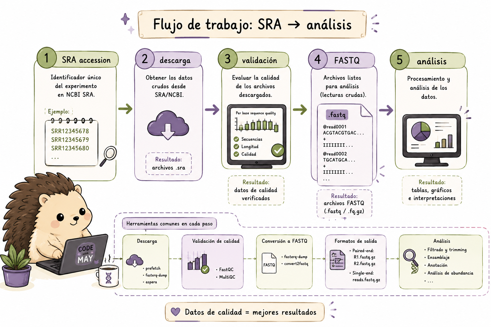

::: idea
### El modelo mental del SRA Toolkit {.unnumbered}

Los datos públicos de secuenciación en formato **Sequence Read Archive (SRA)** que están en NCBI se organizan mediante **accessions** que permiten identificar estudios, experimentos y corridas de secuenciación.

Una forma útil de visualizar el flujo es:

``` text
accession
   ↓
prefetch
   ↓
archivo SRA local
   ↓
vdb-validate
   ↓
fasterq-dump
   ↓
FASTQ
   ↓
análisis
```
Cada paso tiene una función diferente: descargamos los datos, comprobamos que la descarga sea válida y finalmente los convertimos al formato que utilizaremos para el análisis.

{fig-align="center" width="120%"}

::: callout-warning
### Descarga no significa análisis

Un archivo descargado correctamente no garantiza que esté listo para
procesarse. La validación, la comprobación del espacio disponible y la
organización de los archivos forman parte del pipeline.
:::
:::

El **SRA Toolkit** (Sequence Read Archive Toolkit) del NCBI permite
descargar datos de secuenciación directamente desde el archivo SRA. Es
la herramienta estándar para acceder a datos públicos de NGS, proporciona las herramientas necesarias para realizar este proceso desde la línea de comandos.


## Instalación y configuración

Antes de utilizar las herramientas del SRA Toolkit necesitamos instalarlas y configurar el entorno.

En herramientas que trabajan con archivos de secuenciación grandes, también es importante considerar dónde se almacenarán las descargas y cuánto espacio estará disponible para los archivos temporales y los FASTQ resultantes.

En esta sección veremos las opciones principales para Linux/macOS y Windows.

### Instalación en Linux/macOS

Una de las formas más sencillas de instalar SRA Toolkit es mediante Conda. También es posible descargar directamente los binarios desde el NCBI.

``` bash
# --- Opción 1: Conda (recomendada) ---
conda install -c bioconda sra-tools

# --- Opción 2: Descarga directa (Linux) ---
# Verificar la versión más reciente en: https://github.com/ncbi/sra-tools/wiki/01.-Downloading-SRA-Toolkit
wget https://ftp-trace.ncbi.nlm.nih.gov/sra/sdk/current/sratoolkit.current-ubuntu64.tar.gz
tar -xzf sratoolkit.current-ubuntu64.tar.gz
export PATH=$PATH:$(pwd)/sratoolkit.*/bin

# --- Verificar instalación ---
fastq-dump --version
prefetch --version
```

### Instalación en Windows - WSL (recomendado)

Si utilizas Windows y el tutorial está basado principalmente en comandos Bash, **WSL (Windows Subsystem for Linux)** proporciona un entorno Ubuntu dentro de Windows y permite trabajar con el SRA Toolkit utilizando comandos similares a los de Linux.

::: {.callout-note}
## ¿Por qué utilizar WSL?

WSL permite trabajar con Bash y herramientas como Conda dentro de un entorno Linux, lo que resulta especialmente útil cuando posteriormente trabajes con servidores o clústeres bioinformáticos.
:::

#### Paso 1 - Habilitar WSL

Abre PowerShell como administrador:

``` powershell
# Instala Ubuntu por defecto; requiere reiniciar el equipo
wsl --install

# Verificar la versión instalada
wsl --list --verbose
```

#### Paso 2 - Abrir la terminal Ubuntu e instalar dependencias

Después de instalar WSL, abre la terminal de Ubuntu y continúa con la instalación.

``` bash
sudo apt-get update && sudo apt-get upgrade -y
sudo apt-get install -y libxml2 curl wget
```

#### Paso 3 - Instalar SRA Toolkit dentro de WSL

``` bash
# Opción A: conda/mamba (más sencillo)
conda install -c bioconda sra-tools

# Opción B: descarga directa del binario Linux
curl -o sratoolkit.tar.gz \
  https://ftp-trace.ncbi.nlm.nih.gov/sra/sdk/current/sratoolkit.current-ubuntu64.tar.gz

tar -xzf sratoolkit.tar.gz
export PATH=$PATH:$(pwd)/sratoolkit.*/bin

# Agregar al PATH permanentemente
echo 'export PATH=$PATH:~/sratoolkit/bin' >> ~/.bashrc
source ~/.bashrc
```

#### Paso 4 - Verificar e integrar con el sistema de archivos de Windows

También podemos acceder desde WSL a los archivos almacenados en Windows mediante `/mnt/c/`.

``` bash
# Verificar que funciona
prefetch --version
fasterq-dump --version

# Por ejemplo, guardar FASTQs en el Escritorio de Windows:
fasterq-dump SRR16885503 --outdir /mnt/c/Users/$USER/Desktop/fastq/
```

------------------------------------------------------------------------

::: panel-tabset
### Ejercicio 1:

**¿Cuál de estos comandos debes ejecutar en PowerShell (como
Administrador) para habilitar WSL e instalar Ubuntu?**

a)  `wsl --enable ubuntu`\
b)  `Set-WSL -Install -Distribution Ubuntu`\
c)  **`wsl --install`**\
d)  `Enable-WindowsOptionalFeature -Online -FeatureName Microsoft-Windows-Subsystem-Linux`

### ✅ Solución

La respuesta correcta es **c)**. Desde Windows 10 (build 19041) y
Windows 11, el comando `wsl --install` hace todo en un paso: activa el
componente WSL, instala el kernel de Linux y descarga Ubuntu como
distribución por defecto. Después hay que reiniciar el equipo. La opción
**d)** era la forma antigua (manual) antes de esta actualización.
:::


## `prefetch` y `fasterq-dump`

Antes de utilizar estas herramientas, necesitamos distinguir entre el **accession**, el archivo SRA y el FASTQ.

### ¿Qué es un accession?

Un *accession* es el identificador utilizado para localizar un recurso dentro de las bases de datos del NCBI. Los *runs* del SRA suelen identificarse con códigos que comienzan con `SRR`.

Por ejemplo:

```text
SRR12345678
```

::: idea
### ¿Por qué hay dos pasos?

`prefetch` y `fasterq-dump` cumplen funciones diferentes.

-   **`prefetch`** descarga el objeto SRA y lo almacena localmente.
-   **`fasterq-dump`** convierte esos datos a FASTQ.

Separar ambas operaciones permite validar y reutilizar la descarga antes
de generar los FASTQ. También hace más fácil reiniciar un pipeline si la
conversión falla sin tener que volver a descargar los datos.

El patrón conceptual es:

``` text
accession → prefetch → archivo SRA local → fasterq-dump → FASTQ
```
:::

### Descarga con `prefetch`

Una vez que tenemos el accession, podemos descargar el run correspondiente.

``` bash
# Descargar un SRA run (formato .sra)
prefetch SRR12345678

# Descargar múltiples accessions
prefetch SRR12345678 SRR12345679 SRR12345680

# Descargar desde una lista de accessions (un ID por línea)
prefetch --option-file lista_sra.txt

# Especificar directorio de salida
prefetch SRR12345678 --output-directory ./mis_datos/

# Limitar el tamaño máximo de descarga (en KB, aquí 20 GB)
prefetch SRR12345678 --max-size 20000000

# Verificar integridad después de descargar
prefetch --verify yes SRR12345678
```

### Convertir a FASTQ con `fasterq-dump`

``` bash
# Convertir .sra a FASTQ (automáticamente detecta paired/single-end)
fasterq-dump SRR12345678

# Especificar directorio de salida
fasterq-dump SRR12345678 --outdir ./fastq_files/

# Utilizar varios hilos (por defecto: 6)
fasterq-dump SRR12345678 --threads 8

# Convertir y después comprimir
fasterq-dump SRR12345678 --outdir ./fastq_files/ && \
  gzip ./fastq_files/SRR12345678*.fastq

# Pipeline: prefetch + fasterq-dump en un paso (descargar y comprimir)
prefetch SRR12345678 && fasterq-dump SRR12345678 --outdir ./fastq/

# Para datos paired-end, genera automáticamente:
# SRR12345678_1.fastq (R1)
# SRR12345678_2.fastq (R2)
```


En el primer bloque trabajamos con la descarga. En el segundo utilizamos el archivo descargado para generar los FASTQ que podremos utilizar posteriormente en nuestro pipeline de análisis.

En datos *paired-end*, los reads de cada pareja se almacenan normalmente en archivos separados, como `R1` y `R2`.


### Descarga directa en la nube (sin prefetch)

En algunos entornos puede ser conveniente trabajar directamente con los datos disponibles en la nube, evitando almacenar previamente todo el objeto SRA de forma local. Esta opción depende del entorno y del tipo de datos con el que estemos trabajando.

``` bash
# Descargar directamente sin usar caché local (útil en la nube)
fasterq-dump --ngc prj_prot.ngc SRR12345678  # datos controlados de acceso

# Usando fasterq-dump directo desde cloud
fasterq-dump SRR12345678 --outdir . --progress
```

------------------------------------------------------------------------

::: panel-tabset
### Ejercicio 2:

**¿Cuál es la secuencia correcta para descargar y convertir datos del
SRA?**

a)  `fasterq-dump SRR123 → prefetch SRR123`\
b)  **`prefetch SRR123 → fasterq-dump SRR123`**\
c)  `sra-download SRR123 → fastq-convert SRR123`\
d)  Es indiferente el orden, ambas herramientas son independientes

### ✅ Solución

La respuesta correcta es **b)**.

El flujo correcto es: 1. `prefetch` descarga el archivo `.sra` comprimido y validado al caché local 2. `fasterq-dump` convierte el archivo `.sra` local a formato FASTQ

Si se usa `fasterq-dump` directamente sin `prefetch`, se descargará de todas formas, pero es menos eficiente y propenso a errores de red. El workflow `prefetch → fasterq-dump` es más robusto.
:::

------------------------------------------------------------------------

::: panel-tabset
### Ejercicio 3:

Completa el script para descargar y convertir **una lista de 5 accessions** desde `accessions.txt`, usando 8 hilos y guardando los FASTQ comprimidos en `./data/fastq/`:

``` bash
mkdir -p ./data/fastq

while read acc; do
  echo "Procesando: $acc"
  prefetch ___ --output-directory ./data/
  fasterq-dump ./data/${acc} \
    --outdir ./data/fastq/ \
    --threads ___ \
    --progress
  # Comprimir los FASTQ generados
  ___ ./data/fastq/${acc}*.fastq
done < ___
```

### ✅ Solución

``` bash
mkdir -p ./data/fastq

while read acc; do
  echo "Procesando: $acc"
  prefetch "$acc" --output-directory ./data/
  fasterq-dump "./data/${acc}" \
    --outdir ./data/fastq/ \
    --threads 8 \
    --progress
  # Comprimir los FASTQ generados
  gzip ./data/fastq/${acc}*.fastq
done < accessions.txt
```
:::

------------------------------------------------------------------------

## `vdb-validate` y Metadatos

Descargar un archivo no significa automáticamente que podamos confiar en
él. Una descarga interrumpida o dañada puede producir errores mucho
después, durante una etapa de análisis que nada tiene que ver con la
descarga. `vdb-validate` permite comprobar la integridad de los datos
del SRA antes de continuar.

Los metadatos también son importantes. El accession nos permite localizar un recurso, pero para diseñar un análisis necesitamos saber qué organismo corresponde a cada muestra, qué experimento representa y qué condiciones experimentales se describieron.

En otras palabras, **los datos de secuenciación y sus metadatos forman parte del mismo experimento**.

### Validación de archivos

``` bash
# Validar la integridad de un archivo .sra
vdb-validate SRR12345678.sra

# Validar todos los SRA en el caché
vdb-validate ~/ncbi/public/sra/

# Obtener información detallada de un accession
sra-stat --xml --statistics SRR12345678

# Mostrar un read de prueba
fastq-dump -X 1 --stdout SRR12345678  # imprime solo el primer read
```

### Información y metadatos con `sam-dump`

``` bash
# Obtener metadatos del experimento
prefetch SRR12345678
sam-dump --header SRR12345678 | head -50

# Obtener solo el header SAM (metadatos de secuenciación)
sam-dump --header-only SRR12345678

# Ver los primeros N reads como SAM
sam-dump SRR12345678 | head -n 100
```

`vdb-validate` se utiliza para comprobar que los datos descargados pueden leerse correctamente. Las herramientas de estadísticas y `sam-dump` permiten consultar información adicional del run.

No todas estas herramientas cumplen la misma función: algunas sirven para validar, otras para consultar información y otras para inspeccionar los datos.

------------------------------------------------------------------------

## Descargas en Lote (Batch)

###  De una muestra a muchas muestras

Hasta ahora hemos trabajado con un solo accession. En un estudio real podemos tener decenas o incluso cientos de runs.

Copiar y pegar los mismos comandos para cada muestra no es una buena estrategia: además de ser tedioso, hace más difícil repetir el análisis y detectar errores.

Una alternativa es guardar los accessions en un archivo y utilizar Bash para procesarlos automáticamente.


::: {.callout-note}
## 🧠 Una lista de accessions

Un archivo como `accessions.txt` permite separar **los datos que queremos procesar** de **la lógica que los procesa**.

Esto permite:

- volver a ejecutar el pipeline con otra lista;
- revisar qué muestras forman parte del análisis;
- registrar errores y éxitos;
- añadir paralelización sin reescribir todo el procedimiento.
:::

En un estudio real podemos trabajar con decenas o cientos de accessions. En lugar de repetir los mismos comandos para cada muestra, podemos utilizar loops, funciones Bash o `GNU parallel` para automatizar el proceso.

Un buen script de *batch* también debería indicar qué muestra se está procesando, registrar los errores y permitir continuar el trabajo cuando sea posible.

### Scripts para múltiples accessions

#### Método 1: Loop con una lista de accessions

Un `while` permite recorrer el archivo una línea a la vez y ejecutar las mismas operaciones para cada accession.

``` bash
cat accessions.txt | while read acc; do
  echo "[$(date)] Descargando $acc..."
  prefetch "$acc" 2>> prefetch_errors.log && \
  fasterq-dump "$acc" --outdir ./fastq/ --threads 4 && \
  gzip ./fastq/${acc}*.fastq
  echo "[$(date)] Completado: $acc"
done
```

#### Método 2: Con GNU `parallel` (más eficiente)

Cuando tenemos muchas muestras, podemos ejecutar varios procesos al mismo tiempo utilizando GNU `parallel`.

```
cat accessions.txt | parallel -j3 \
  "prefetch {} && fasterq-dump {} --outdir ./fastq/ --threads 4 && gzip ./fastq/{}*.fastq"
```

Aquí `-j3` indica que se pueden ejecutar hasta tres procesos simultáneamente.

# Método 3: Con manejo de errores y reintentos

También podemos crear una función que intente nuevamente una descarga cuando ocurre un error.

```
download_sra() {
  acc=$1
  max_retries=3
  attempt=1
  while [ $attempt -le $max_retries ]; do
    echo "Intento $attempt para $acc"
    prefetch "$acc" --output-directory ./sra/ && \
    fasterq-dump "./sra/$acc" --outdir ./fastq/ --threads 6 && \
    gzip ./fastq/${acc}*.fastq && \
    echo "$acc" >> descargas_exitosas.txt && return 0
    ((attempt++))
    sleep 10
  done
  echo "$acc" >> descargas_fallidas.txt
  return 1
}
export -f download_sra
cat accessions.txt | parallel -j2 download_sra {}
```

Aquí ya no estamos ejecutando simplemente un comando, sino construyendo un pequeño pipeline automatizado.

Para cada accession:

1. se intenta descargar el SRA;
2. se convierte a FASTQ;
3. se comprimen los archivos;
4. se registra si el proceso terminó correctamente;
5. si ocurre un error, se vuelve a intentar hasta alcanzar el número máximo de intentos.

Esta estructura permite trabajar con muchas muestras sin tener que escribir manualmente cada comando.

------------------------------------------------------------------------

::: panel-tabset
### Ejercicio 4

Tienes el archivo `SraRunTable.txt` descargado del NCBI SRA con
metadatos de un estudio. Construye un pipeline que:

1.  Extraiga los accession numbers (columna `Run`) de las muestras
    *Homo sapiens* en condición **"treated"**
2.  Descargue los FASTQs correspondientes en paralelo (máx. 3
    simultáneos)
3.  Verifique la integridad de cada descarga
4.  Genere un reporte con: accession, número de reads, tamaño del
    archivo

### ✅ Solución 

``` bash
# 1. Extraer accessions de muestras humanas en condición "treated"
# (asumiendo columnas: Run, Organism, treatment)
awk -F',' 'NR>1 && $5=="Homo sapiens" && $8=="treated" {print $1}' \
  SraRunTable.txt > accessions_treated.txt

echo "Accessions a descargar: $(wc -l < accessions_treated.txt)"

# 2. Función de descarga con verificación
download_and_validate() {
  acc=$1
  echo "[$(date +%H:%M:%S)] Iniciando $acc"
  
  # Descargar
  prefetch "$acc" --output-directory ./sra/ || { echo "ERROR prefetch $acc"; return 1; }
  
  # Validar
  vdb-validate ./sra/$acc || { echo "ERROR validación $acc"; return 1; }
  
  # Convertir
  fasterq-dump ./sra/$acc --outdir ./fastq/ --threads 4 || return 1
  gzip ./fastq/${acc}*.fastq
  
  echo "$acc completado" >> progreso.log
}
export -f download_and_validate

# 3. Ejecutar en paralelo (máx 3)
cat accessions_treated.txt | parallel -j3 download_and_validate {}

# 4. Generar reporte
echo -e "Accession\tReads\tTamaño_MB" > reporte_descargas.tsv
for f in ./fastq/*.fastq.gz; do
  acc=$(basename "$f" | cut -d'_' -f1 | cut -d'.' -f1)
  reads=$(zcat "$f" | wc -l | awk '{print $1/4}')
  size=$(du -m "$f" | cut -f1)
  echo -e "$acc\t$reads\t$size"
done >> reporte_descargas.tsv

cat reporte_descargas.tsv
```
:::

------------------------------------------------------------------------
