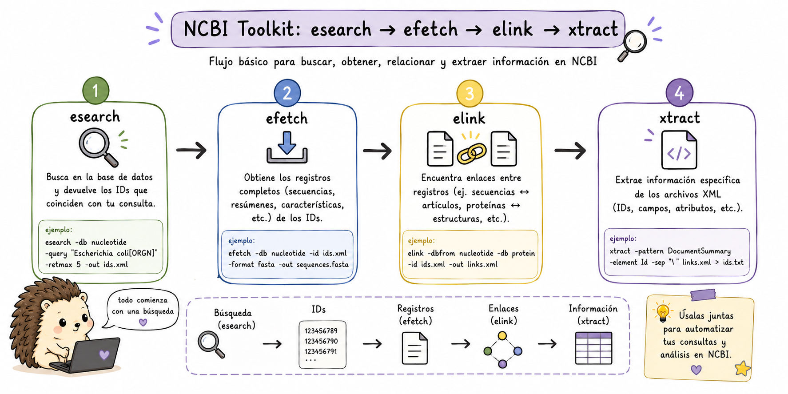
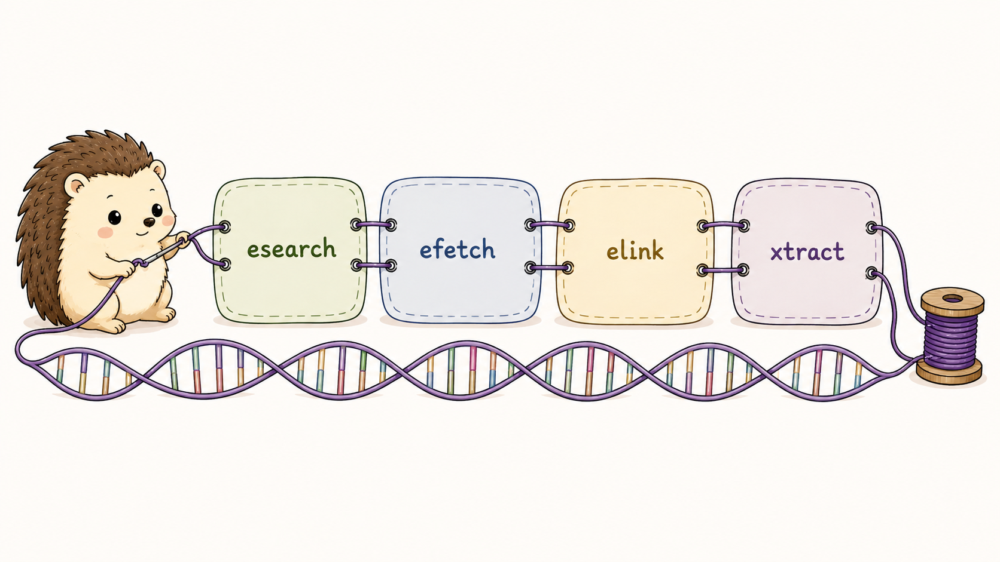

::: callout-note
## 🧬 Pensar en NCBI como una colección de bases conectadas

Las E-utilities son un conjunto de herramientas que permiten **buscar, recuperar y conectar información entre diferentes bases de datos del NCBI** (PubMed, GenBank, SRA, Protein, etc.) directamente desde la línea de comandos o scripts.

En lugar de abrir una página web y copiar resultados manualmente, podemos realizar consultas desde la terminal y utilizar su salida directamente en otros comandos.

La lógica que seguiremos en esta sección es:

``` bash
explorar → buscar → recuperar → conectar → extraer
  einfo     esearch   efetch     elink      xtract
```

Cada herramienta cumple una función diferente, pero podemos combinarlas para construir pipelines reproducibles.

La idea fundamental es pensar en las E-utilities como piezas de un sistema de consulta:

``` bash
einfo   → ¿qué bases y campos existen?
esearch → ¿qué registros cumplen mi búsqueda?
efetch  → ¿qué información quiero recuperar?
elink   → ¿qué registros relacionados existen?
xtract  → ¿qué campos quiero extraer de XML?
```
:::

{fig-align="center" width="120%"}

Esta separación permite construir pipelines reproducibles y evita descargar información que no necesitamos.

::: callout-note
## Registro recomendado

Aunque las E-utilities son de acceso libre, se recomienda registrarse en NCBI y usar tu API key para evitar límites de velocidad. Con API key: 10 solicitudes/segundo; sin ella: 3 solicitudes/segundo.

``` bash
export NCBI_API_KEY="tu_api_key_aqui"
```
:::

## `einfo` - Explorar bases de datos

Antes de hacer una búsqueda compleja, es útil saber cómo está organizada la base de datos. `einfo` proporciona información sobre las bases disponibles, los campos que pueden utilizarse en las consultas y los enlaces entre bases.

Esto es especialmente importante porque las búsquedas de NCBI no son simplemente búsquedas de texto libre. Los campos como `[Organism]`, `[Gene Name]`, `[PDAT]` o `[Title/Abstract]` permiten restringir la consulta y obtener resultados mucho más precisos.

#### **Ejemplos:**

``` bash
# Listar todas las bases de datos disponibles en NCBI
esearch -db all -query "" | einfo

# Información detallada de una base de datos específica
einfo -db nucleotide

# Ver campos de búsqueda disponibles
einfo -db pubmed -fields

# Ver los links disponibles entre bases de datos
einfo -db sra -links
```

Estos comandos responden preguntas diferentes sobre la base de datos:

-   ¿Qué bases existen?
-   ¿Qué campos puedo utilizar en una búsqueda?
-   ¿Qué información y relaciones ofrece una base concreta?

Conocer esta estructura antes de construir una consulta ayuda a evitar búsquedas demasiado generales.

## `esearch` y `efetch` - Buscar y Descargar

::: idea
### 🔎 Separar la búsqueda de la recuperación

Una idea fundamental de E-utilities es que **buscar un registro y recuperar su contenido son operaciones diferentes**.

`esearch` responde esencialmente a: "¿qué registros cumplen esta consulta?".

`efetch` responde: "dame el contenido de esos registros en el formato que necesito".

Por eso es tan común encontrar pipelines como:

``` bash
esearch ... | efetch ...
```
:::

Podemos pensarlo así:

``` bash
esearch
  ↓
IDs
  ↓
efetch
  ↓
datos
```

Esta separación permite, por ejemplo, buscar todos los transcritos que cumplen una condición y después decidir si queremos sus secuencias FASTA, registros GenBank o metadatos.

### Búsquedas básicas

Podemos utilizar `esearch` para buscar registros en diferentes bases de datos. La consulta se escribe con `-query` y puede incluir términos y campos específicos.

``` bash
# Buscar en PubMed
esearch -db pubmed -query "BRCA1 AND breast cancer[MeSH] AND 2023[PDAT]"

# Contar resultados sin descargar
esearch -db nucleotide -query "Homo sapiens[Organism] AND 16S rRNA" | \
  xtract -pattern ENTREZ_DIRECT -element Count

# Buscar genes en NCBI Gene
esearch -db gene -query "TP53[Gene Name] AND Homo sapiens[Organism]"

# Buscar en SRA
esearch -db sra -query "Mus musculus[Organism] AND RNA-seq AND 2023[PDAT]"
```

Observa que la misma herramienta puede utilizarse con diferentes bases de datos. Lo que cambia es `-db` y la consulta que enviamos.

Los campos entre corchetes permiten hacer búsquedas más específicas. Por ejemplo:

-   `[Organism]` → organismo
-   `[Gene Name]` → nombre del gen
-   `[PDAT]` → fecha de publicación
-   `[Title/Abstract]` → título o resumen

### Descarga con `efetch`

Una vez que tenemos un identificador o la salida de una búsqueda, podemos utilizar `efetch` para recuperar el contenido que necesitamos.

El formato de salida depende de la base de datos y del tipo de información que queremos obtener.

``` bash
# Descargar secuencia en formato FASTA
efetch -db nucleotide -id NM_007294 -format fasta > BRCA1.fa

# Descargar en formato GenBank
efetch -db nucleotide -id NM_007294 -format gb > BRCA1.gb

# Descargar múltiples secuencias
efetch -db nucleotide -id NM_007294,NM_000546,NM_000059 -format fasta > genes.fa

# Pipeline: buscar + descargar
esearch -db nucleotide -query "BRCA1[Gene] AND Homo sapiens[Organism] AND mRNA[Filter]" | \
  efetch -format fasta > BRCA1_transcripts.fa

# Descargar secuencia de proteína
efetch -db protein -id NP_009225 -format fasta > BRCA1_protein.fa

# Descargar abstract de un artículo de PubMed
efetch -db pubmed -id 37465840 -format abstract
```

En los primeros ejemplos ya conocemos los identificadores y se los pasamos directamente a `efetch`.

En el pipeline, en cambio, `esearch` encuentra los registros y pasa sus identificadores a `efetch`. Esta combinación es una de las formas más útiles de trabajar con las E-utilities.

## Obtener metadatos de SRA

Las E-utilities también permiten consultar información asociada con experimentos y runs del SRA.

Esto resulta especialmente útil cuando necesitamos construir una lista de accessions o recuperar metadatos antes de descargar los datos.

``` bash
# Información de un BioProject
esearch -db sra -query "PRJNA123456" | \
  efetch -format runinfo > runinfo.csv

# Obtener todos los runs de un experimento
esearch -db sra -query "SRX1234567" | \
  efetch -format runinfo | \
  cut -d',' -f1 | grep "^SRR" > runs.txt

# Metadatos completos en XML
esearch -db biosample -query "SAMN12345678" | \
  efetch -format xml | \
  xtract -pattern BioSample -element Accession,Title,Organism
```

En estos ejemplos utilizamos las E-utilities para obtener información que después puede utilizarse en otros pasos del análisis.

Por ejemplo, `runinfo` puede convertirse en una tabla de runs que posteriormente utilizaremos para descargar datos con SRA Toolkit.

## `elink` - Navegar entre bases de datos

::: callout-note
### 🔗 Las bases de NCBI están conectadas

Una de las fortalezas de NCBI es que sus bases están relacionadas. Un artículo puede estar asociado con genes, secuencias o proyectos; un registro de SRA puede estar relacionado con un BioSample; un gen puede tener proteínas y secuencias asociadas. `elink` permite seguir esas relaciones de forma programática.

Podemos pensar en el proceso como:

``` bash
registro A → elink → registro relacionado B → efetch
```

Por ejemplo, podemos partir de una publicación, un gen o un registro de SRA y utilizar sus relaciones para encontrar información adicional. Esto evita tener que buscar manualmente cada identificador.
:::

#### **Ejemplos:**

``` bash
# De PubMed a la secuencia de nucleótidos relacionada
esearch -db pubmed -id 37465840 | elink -target nucleotide | efetch -format fasta

# De gen a proteína
esearch -db gene -query "TP53[Gene Name] AND Homo sapiens[Organism]" | \
  elink -target protein | efetch -format fasta > TP53_proteins.fa

# De SRA a BioSample
esearch -db sra -query "SRR12345678" | elink -target biosample | \
  efetch -format xml | xtract -pattern BioSample -element Accession,Description

# De nucleótido a PubMed
efetch -db nucleotide -id NM_007294 -format xml | \
  elink -target pubmed | efetch -format abstract | head -50
```

## `xtract` - Parsear XML

::: callout-note
### ¿Por qué aparece XML?

Muchas respuestas detalladas del NCBI se entregan en formato XML. XML permite representar información organizada en estructuras jerárquicas, pero no resulta especialmente cómodo para leer o analizar directamente desde la terminal.

`xtract` permite seleccionar patrones y elementos específicos dentro de ese XML y convertirlos en una salida tabular. Es especialmente útil cuando queremos pasar de una respuesta de NCBI a un archivo TSV que posteriormente pueda analizarse con `awk`, `cut`, R o Python.

La idea general es:

``` bash
NCBI → XML → xtract → TSV/CSV → awk/cut/sort/...
```
:::

#### **Ejemplos:**

``` bash
# Extraer información de múltiples genes
esearch -db gene -query "cancer AND Homo sapiens[Organism]" | \
  efetch -format xml | \
  xtract -pattern Entrezgene -element Gene-ref_locus Gene-ref_desc \
    -block Gene-commentary -match Gene-commentary_type@value,reference-genome \
    -element Gene-commentary_accession

# Extraer datos de publicaciones
esearch -db pubmed -query "RNA-seq AND methods[Title]" | \
  efetch -format xml | \
  xtract -pattern PubmedArticle \
    -element MedlineCitation/PMID ArticleTitle \
    -block Author -first LastName,ForeName \
  > publicaciones.tsv
```

Aquí `xtract` actúa como un puente entre una respuesta XML y una tabla que podemos seguir procesando.

No necesitamos aprender toda la estructura de XML para empezar. Lo importante es identificar el patrón que queremos (`-pattern`) y los elementos que queremos recuperar (`-element`).

{fig-align="center" width="60%"}

------------------------------------------------------------------------

::: panel-tabset
### Ejercicio 1

**¿Cuál pipeline descarga correctamente las secuencias de ARNm de BRCA2 humano en formato FASTA?**

a)  

``` bash
efetch -db nucleotide -query "BRCA2 AND mRNA" -format fasta
```

b)  

``` bash
esearch -db gene -query "BRCA2[Gene]" | efetch -format fasta
```

c)  

``` bash
esearch -db nucleotide -query "BRCA2[Gene Name] AND Homo sapiens[Organism] AND mRNA[Filter]" | \
  efetch -format fasta > BRCA2_mRNA.fa
```

d)  

``` bash
einfo -db nucleotide -query "BRCA2" | efetch -format fasta
```

### ✅ Solución

La respuesta correcta es **c)**.

-   **a)** `efetch` no tiene flag `--query`; requiere IDs específicos o input desde `esearch`
-   **b)** Busca en la base de datos `gene`, no en `nucleotide`, y sin filtro de mRNA puede traer otros tipos de secuencias
-   **c)** ✅ Pipeline correcto: `esearch` busca con filtros apropiados → `efetch` descarga en FASTA
-   **d)** `einfo` sirve para explorar la estructura de la base de datos, no para buscar secuencias
:::

------------------------------------------------------------------------

::: panel-tabset
### Ejercicio 2

Completa el pipeline para **descargar los metadatos de runs del SRA** asociados al BioProject `PRJNA548382` y extraer: Run ID, número de bases, y nombre del organismo:

``` bash
esearch -db ___ -query "PRJNA548382[BioProject]" | \
  efetch -format ___ | \
  cut -d',' -f___, ___, ___ | \
  ___ -n '2,$p' > metadatos_runs.csv
```

### ✅ Solución

``` bash
esearch -db sra -query "PRJNA548382[BioProject]" | \
  efetch -format runinfo | \
  cut -d',' -f1,5,30 | \
  sed -n '2,$p' > metadatos_runs.csv

# Versión más robusta con xtract para extraer campos específicos:
esearch -db sra -query "PRJNA548382[BioProject]" | \
  efetch -format xml | \
  xtract -pattern EXPERIMENT_PACKAGE \
    -element RUN@accession,Run@total_bases,SCIENTIFIC_NAME \
  > metadatos_runs.tsv
```

Las posiciones de las columnas de `runinfo` pueden variar dependiendo de la información disponible en el proyecto. Para un pipeline reutilizable, es preferible identificar los nombres de las columnas antes de asumir posiciones fijas.
:::

------------------------------------------------------------------------

::: panel-tabset
### Ejercicio 3:

Construye un pipeline que:

1.  Busque en PubMed artículos sobre "single-cell RNA-seq" publicados en 2022-2023
2.  Cuente el número de artículos encontrados\
3.  Extraiga los PMIDs y los títulos
4.  Guarde el resultado en `scRNAseq_papers.tsv`

### ✅ Solución

``` bash
# 1. Búsqueda y conteo
esearch -db pubmed \
  -query "single-cell RNA sequencing[Title/Abstract] AND 2022:2023[PDAT]" \
  > search_results.xml

count=$(cat search_results.xml | xtract -pattern ENTREZ_DIRECT -element Count)
echo "Artículos encontrados: $count"

# 2. Descargar y parsear metadata
esearch -db pubmed \
  -query "single-cell RNA sequencing[Title/Abstract] AND 2022:2023[PDAT]" | \
  efetch -format xml | \
  xtract -pattern PubmedArticle \
    -element MedlineCitation/PMID \
    -element ArticleTitle \
    -element Journal/Title \
    -element PubDate/Year \
  | sed 's/\t/\t/g' > scRNAseq_papers.tsv

# Agregar encabezado
sed -i '1i PMID\tTitulo\tRevista\tAnio' scRNAseq_papers.tsv

echo "Primeros 5 resultados:"
head -6 scRNAseq_papers.tsv
```
:::

------------------------------------------------------------------------

::: panel-tabset
### Ejercicio 4:

Usando E-utilities, realiza un análisis del número de publicaciones por año (2018-2023) sobre los términos **"metagenomics"**, **"transcriptomics"** y **"proteomics"** y genera una tabla comparativa:

| Año  | Metagenomics | Transcriptomics | Proteomics |
|------|--------------|-----------------|------------|
| 2018 | ...          | ...             | ...        |

### ✅ Solución del Reto

``` bash
# Script de análisis bibliométrico
echo -e "Año\tMetagenomics\tTranscriptomics\tProteomics" > bibliometria.tsv

for year in 2018 2019 2020 2021 2022 2023; do
  meta=$(esearch -db pubmed \
    -query "metagenomics[Title/Abstract] AND ${year}[PDAT]" | \
    xtract -pattern ENTREZ_DIRECT -element Count)
  
  trans=$(esearch -db pubmed \
    -query "transcriptomics[Title/Abstract] AND ${year}[PDAT]" | \
    xtract -pattern ENTREZ_DIRECT -element Count)
  
  prot=$(esearch -db pubmed \
    -query "proteomics[Title/Abstract] AND ${year}[PDAT]" | \
    xtract -pattern ENTREZ_DIRECT -element Count)
  
  echo -e "$year\t$meta\t$trans\t$prot" >> bibliometria.tsv
  sleep 1  # Respetar límites de la API
done

echo "=== Tabla Bibliométrica ==="
cat bibliometria.tsv | column -t -s $'\t'
```
:::

------------------------------------------------------------------------
