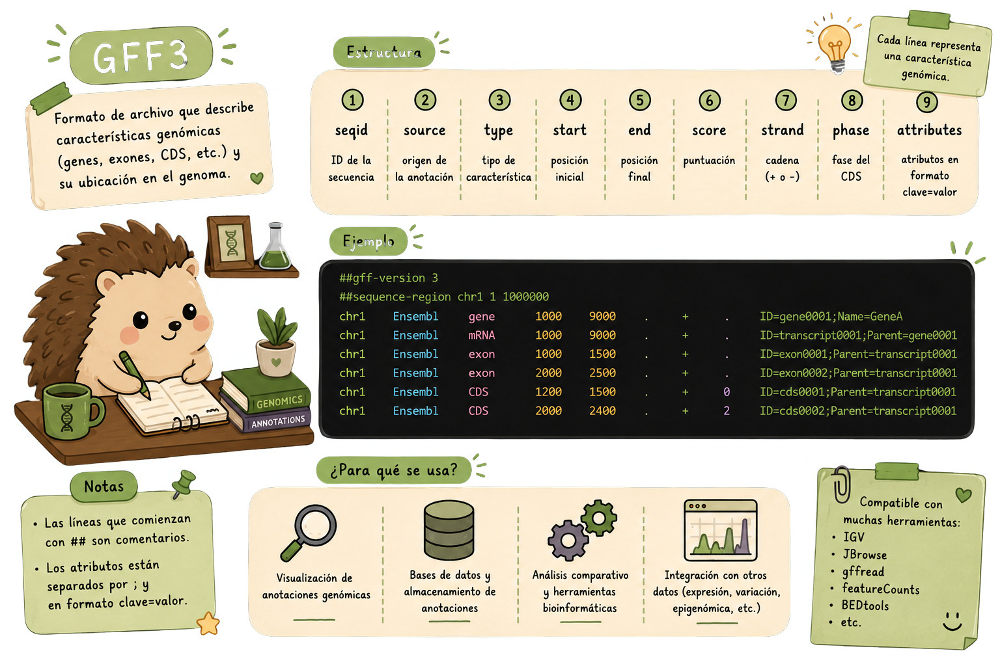

::: {.callout-note}
##  Antes de trabajar con un GFF3

Antes de escribir un filtro, primero identifica qué representa cada columna del archivo. En GFF3, cada línea describe una característica anotada sobre una secuencia, como un gen, transcrito, exón o CDS.
:::

Los archivos GFF3 describen características anotadas sobre secuencias genómicas. A diferencia de FASTA o FASTQ, aquí no estamos almacenando únicamente secuencias: estamos almacenando **información estructurada sobre regiones**, como genes, transcritos, exones, CDS y otras características.

Un archivo GFF3 contiene **nueve columnas separadas por tabuladores**. Algunas indican dónde se encuentra una característica y qué tipo de característica es, mientras que la última columna contiene atributos adicionales, como identificadores y relaciones entre elementos.

Por ejemplo:

```text
chr1    .    gene    1000    5000    .    +    .    ID=gene001

En este registro:

$1 → secuencia o cromosoma (chr1)
$3 → tipo de característica (gene)
$4 → posición inicial (1000)
$5 → posición final (5000)
$7 → hebra (+)
$9 → atributos (ID=gene001)
```

{fig-align="center" width="90%"}

Este formato permite hacer preguntas como: ¿cuántos genes hay?, ¿qué genes están en un cromosoma?, ¿cuánto mide cada gen? o ¿qué identificadores tienen las características anotadas?


## Operaciones sobre archivos GFF3

Una vez que conocemos la estructura del archivo, podemos utilizar herramientas como `grep`, `cut`, `sort`, `uniq`, `perl`, `awk` y `bioawk` para extraer y resumir información.

Los siguientes ejemplos muestran algunas tareas comunes al trabajar con anotaciones.

``` bash
# Listar todas las secuencias anotadas
cut -s -f1,9 anotaciones.gff3 | grep $'\t' | cut -f1 | sort | uniq

# Tipos de features disponibles
grep -v '^#' anotaciones.gff3 | cut -s -f3 | sort | uniq

# Contar genes totales
grep -c $'\tgene\t' anotaciones.gff3

# Extraer todos los IDs de genes
grep $'\tgene\t' anotaciones.gff3 | perl -ne '/ID=([^;]+)/ and printf("%s\n", $1)'

# Longitud de cada gen
grep $'\tgene\t' anotaciones.gff3 | cut -s -f4,5 | \
  perl -ne '@v = split(/\t/); printf("%d\n", $v[1] - $v[0] + 1)'

# Crear tabla transcrito → gen desde GTF de GENCODE
bioawk -c gff '$feature=="transcript" {print $group}' gencode.v28.annotation.gtf | \
  awk -F ' ' '{print substr($4,2,length($4)-3) "\t" substr($2,2,length($2)-3)}' > txp2gene.tsv
```

Estos ejemplos muestran algunas formas de trabajar con la información contenida en un GFF3:

- `cut` permite seleccionar columnas.
- `grep` permite buscar tipos de *features* o patrones específicos.
- `sort` y `uniq` ayudan a obtener valores únicos.
- `awk` y `perl` permiten realizar operaciones sobre los datos y extraer información de los atributos.
- `bioawk` permite trabajar directamente con formatos de anotación.

------------------------------------------------------------------------

::: panel-tabset
### Ejercicio 1:

Dado un archivo `genome.gff3`, construye un pipeline que:

1.  Extraiga todos los genes del cromosoma `chr1`
2.  Calcule la longitud de cada gen (fin - inicio + 1)
3.  Filtre los genes con longitud \> 10,000 bp
4.  Reporte: ID del gen, inicio, fin, longitud, ordenados por longitud
    descendente
5.  Guarde en `chr1_genes_largos.tsv`

### ✅ Solución 

``` bash
grep $'\tgene\t' genome.gff3 | \
  awk '$1 == "chr1"' | \
  awk 'BEGIN{OFS="\t"; print "gene_id\tinicio\tfin\tlongitud"}
  {
    len = $5 - $4 + 1
    if (len > 10000) {
      # Extraer el gene_id del campo de atributos ($9)
      match($9, /ID=([^;]+)/, arr)
      print arr[1], $4, $5, len
    }
  }' | \
  sort -k4nr > chr1_genes_largos.tsv

echo "Genes con longitud > 10kb en chr1:"
wc -l chr1_genes_largos.tsv
head -5 chr1_genes_largos.tsv
```
:::

