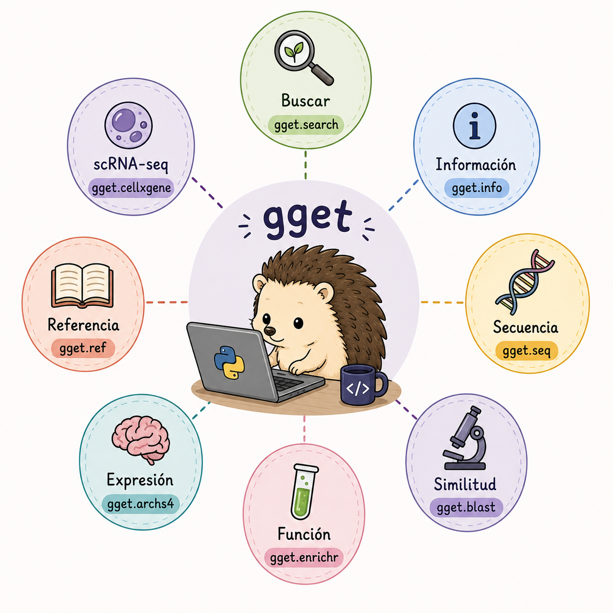
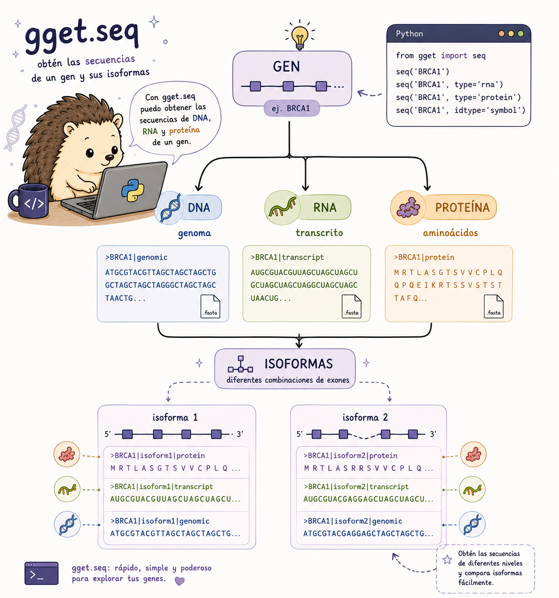
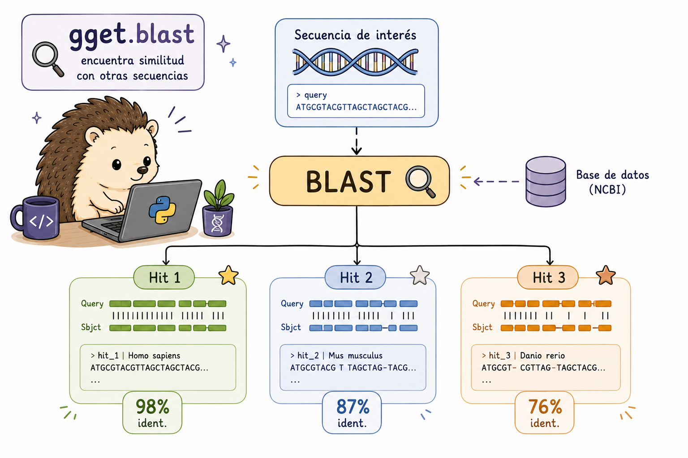

## Introducción a `gget`

Hasta aquí hemos trabajado principalmente con herramientas de línea de comandos. Sin embargo, existen otras herramientas de otros entornos como: [gget](https://github.com/pachterlab/gget) es una librería de Python (y herramienta de línea de comandos) para consultar bases de datos genómicas de referencia como Ensembl, UniProt, NCBI, BLAST, y más, de manera reproducible.

Esto resulta útil cuando queremos pasar de una consulta puntual a un análisis reproducible que incluya procesamiento adicional con `pandas`, filtros, ciclos, visualizaciones u otras librerías.

Existen diferentes módulos de `gget`y cada uno nos puede ayudar con alguna pregunta biológica, algunas pueden ser las siguientes:

| Pregunta                                  | Herramienta      |
|-------------------------------------------|------------------|
| ¿Dónde está este gen?                     | `gget.search`    |
| ¿Qué información tiene?                   | `gget.info`      |
| ¿Cuál es su secuencia?                    | `gget.seq`       |
| ¿Con qué secuencias se parece?            | `gget.blast`     |
| ¿Qué funciones están enriquecidas?        | `gget.enrichr`   |
| ¿Dónde se expresa?                        | `gget.archs4`    |
| ¿Dónde encuentro un genoma de referencia? | `gget.ref`       |
| ¿Qué datasets de scRNA-seq existen?       | `gget.cellxgene` |

Piensa en esta tabla como un mapa: primero identifica **qué pregunta quieres responder** y después elige la herramienta.

{fig-align="center" width="90%"}

Nuestro objetivo es aprender a elegir el módulo según la **pregunta biológica**, no memorizar todos los módulos de `gget`.

## Instalación

Puedes instalar `gget` utilizando `pip` o `conda`:

``` bash
# Instalar con pip
pip install gget

# Instalar con conda
conda install -c conda-forge gget

# Verificar instalación
python -c "import gget; print(gget.__version__)"
```

Una vez instalado, podemos importarlo desde Python:

``` python
# Importar en Python
import gget
```

## `gget.search` - Búsqueda de genes

Cuando conocemos el nombre de un gen, podemos utilizar `gget.search` para localizar información relacionada.

Sin embargo, un nombre por sí solo puede ser ambiguo. El mismo símbolo puede aparecer en diferentes organismos o devolver varios resultados. Por eso conviene revisar los identificadores y la especie antes de continuar.

En un análisis reproducible, es preferible trabajar con identificadores estables cuando sea posible.

``` python
import gget

# Buscar genes por nombre o palabra clave
resultados = gget.search("BRCA2", "homo_sapiens")
print(resultados)

# Buscar en múltiples especies
gget.search("TP53", "mus_musculus")

# Buscar por descripción (más amplio)
gget.search("breast cancer susceptibility", "homo_sapiens")

# Guardar resultados en CSV
resultados = gget.search("insulin receptor", "homo_sapiens", save=True)
```

``` bash
# También podemos utilizar gget desde Bash
gget search BRCA2 homo_sapiens
gget search "insulin receptor" homo_sapiens --json
```

### ¿Qué debemos revisar? {.unnumbered}

Cuando obtenemos varios resultados, no elijas automáticamente el primero. Revisa al menos:

-   el nombre del gen;
-   el organismo;
-   el identificador;
-   la descripción.

Esto ayuda a asegurarnos de que el registro corresponde a la pregunta que queremos responder.

## `gget.info` - Obtener información de un gen

Una vez identificado un gen, `gget.info` permite consultar información adicional sobre ese registro.

Puede ser útil para comprobar el identificador, organismo, anotación y otros datos antes de descargar una secuencia.

``` python
# Información completa de un gen por Ensembl ID
info = gget.info("ENSG00000139618")  # BRCA2
print(info)

# Múltiples genes a la vez
gget.info(["ENSG00000139618", "ENSG00000141510", "ENSG00000012048"])  # BRCA2, TP53, BRCA1

# Información de transcriptos específicos
gget.info("ENST00000380152")  # transcripto de BRCA2

# Con símbolo del gen en lugar del ID de Ensembl
gget.info("BRCA2", uniprot=True)
```

``` bash
gget info ENSG00000139618
gget info ENSG00000139618 --uniprot
```

## `gget.seq` --- Obtener secuencias

Una vez que tenemos identificado un gen, podemos utilizar `gget.seq` para obtener su secuencia.

Pero antes hay una pregunta importante: **¿qué secuencia necesitamos?**

Un mismo gen puede estar asociado con diferentes transcriptos e isoformas, y podemos trabajar con ADN, ARN o proteína. Por eso es importante comprobar qué representa la secuencia antes de utilizarla en otro análisis.


| Lo que buscamos            | Ejemplo             |
|----------------------------|---------------------|
| Secuencia de un gen        | ADN                 |
| Secuencia de un transcrito | ARN                 |
| Secuencia traducida        | proteína            |
| Diferentes isoformas       | varios transcriptos |


{fig-align="center" width="90%"}


``` python
# Secuencia de DNA de un gen
seq = gget.seq("ENSG00000139618")
print(seq[:100])  # primeros 100 nt

# Secuencia de ARNm (transcripto)
gget.seq("ENST00000380152", translate=False)

# Secuencia de aminoácidos (proteína)
prot = gget.seq("ENSG00000139618", translate=True)

# Guardar en FASTA
gget.seq(["ENSG00000139618", "ENSG00000141510"], save=True)

# Isoformas de un gen
gget.seq("ENSG00000139618", isoforms=True)
```

``` bash
gget seq ENSG00000139618 --translate    # proteína
gget seq ENSG00000139618 --save         # guarda .fa
gget seq ENSG00000139618 --isoforms     # todas las isoformas
```

::: {.callout-tip}
### 💡 Antes de usar una secuencia

Comprueba siempre:

- qué molécula representa;
- de qué organismo proviene;
- qué identificador tiene;
- si corresponde a una isoforma concreta.
:::


## `gget.blast` — Buscar secuencias similares

BLAST permite comparar una secuencia con una base de datos y encontrar secuencias similares.

Sin embargo, una similitud no significa automáticamente que dos secuencias tengan la misma función. Para interpretar los resultados debemos considerar diferentes métricas, como:

- porcentaje de identidad;
- cobertura;
- **E-value**;
- **bit score**;
- longitud del alineamiento.

La elección del programa depende del tipo de consulta: `blastn` compara nucleótidos, `blastp` proteínas y otras variantes permiten comparar distintos tipos de secuencia.

{fig-align="center" width="90%"}


``` python
# BLAST de una secuencia
seq = "MPIGSKERPTFFEIFKTRCNKADLTHSQISLDNHQHSLDNKEFNPKGLKQKGKRQILIKKLNEELISNEERDKLL"

resultados_blast = gget.blast(seq)
print(resultados_blast[['Description', 'E value', 'Per. Ident', 'Accession']])

# Especificar tipo de BLAST y base de datos
gget.blast(seq,
           program="blastp",    # blastn, blastp, blastx, tblastn, tblastx
           database="nr",       # nt, nr, swissprot, pdb
           limit=10)            # número de hits a retornar

# BLAST de una secuencia de DNA
gget.blast("ATGCGTACGTAGCTAGCTAGC", program="blastn", database="nt")
```

## `gget.enrichr` — Análisis de enriquecimiento

Cuando tenemos una lista de genes, puede ser difícil interpretar cada gen individualmente. Un análisis de enriquecimiento pregunta si determinadas categorías funcionales aparecen con una frecuencia mayor de la esperada dentro de esa lista.

`gget.enrichr` trabaja con la **lista de genes** y permite explorar qué funciones, procesos o vías aparecen representados de forma destacada.

La pregunta cambia respecto a las herramientas anteriores:

```text
search → ¿qué gen es?

info → ¿qué información tiene?

seq → ¿cuál es su secuencia?

enrichr → ¿qué tienen en común estos genes?
```

::: {.callout-note}
### 🧠 Importante

Un resultado enriquecido no significa que los genes "causen" esa función. Indica que una categoría funcional está representada de forma destacada en la lista analizada.

La interpretación depende de cómo se obtuvo la lista de genes y de la base de datos utilizada.
:::


``` python
# Análisis de enriquecimiento de términos GO
genes = ["BRCA1", "BRCA2", "TP53", "ATM", "CHEK2", "PALB2"]

enrichr_result = gget.enrichr(genes, database="ontology")
print(enrichr_result[['Rank', 'Term', 'Overlap', 'Adjusted P-value', 'Genes']])

# Múltiples bases de datos de enriquecimiento
for db in ["pathway", "transcription", "kinase", "disease"]:
    result = gget.enrichr(genes, database=db)
    result.to_csv(f"enrichment_{db}.csv")

# KEGG pathway enrichment
gget.enrichr(genes, database="KEGG_2021_Human")

# Visualización integrada (genera plot automáticamente)
gget.enrichr(genes, database="ontology", plot=True)
```

``` bash
gget enrichr BRCA1 BRCA2 TP53 ATM --database ontology
gget enrichr BRCA1 BRCA2 TP53 --database pathway --json
```

## `gget.archs4` — Explorar expresión génica

`gget.archs4` permite explorar patrones de expresión utilizando datos públicos de RNA-seq.

Podemos utilizarlo para preguntas como:

- ¿En qué tejidos se expresa un gen?
- ¿Cómo cambia su expresión entre tejidos?
- ¿Qué genes presentan patrones de expresión similares?

::: {.callout-note}
### ⚠️ Contexto, no sustituto de un análisis diferencial

ARCHS4 puede ayudarnos a explorar patrones de expresión utilizando grandes colecciones públicas de datos de RNA-seq. Sin embargo,  ARCHS4 puede servir como contexto o exploración, pero no sustituye un análisis diferencial diseñado para un experimento específico.
:::


``` python
# Expresión de un gen en diferentes tejidos (ARCHS4)
expr = gget.archs4("BRCA1", which="tissue")
print(expr.head(10))

# Expresión en líneas celulares
gget.archs4("TP53", which="cells")

# Genes correlacionados con un gen de interés
correlados = gget.archs4("MYC", which="correlation")
print(correlados.head(20))
```

## `gget.ref` — Genomas de referencia

Cuando trabajamos con datos genómicos, necesitamos saber qué referencia estamos utilizando.

`gget.ref` permite localizar recursos de referencia, como genomas y anotaciones, y obtener las URLs o archivos correspondientes. Esto resulta especialmente útil cuando queremos automatizar la obtención de archivos y evitar copiar manualmente URLs de servidores FTP.

::: {.callout-note}
### ⚠️ Nota:
La versión de la referencia también importa. Si un análisis depende de una versión concreta de Ensembl, debemos registrarla para que otra persona pueda reproducir exactamente la descarga.
:::

``` python
# Obtener URLs del genoma de referencia de una especie
ref = gget.ref("homo_sapiens")
print(ref)  # Muestra URLs de FTP de Ensembl para genome, GTF, etc.

# Descargar directamente
gget.ref("mus_musculus", which=["genome", "gtf"])

# Versión específica de Ensembl
gget.ref("homo_sapiens", release=109)

# Múltiples especies
gget.ref(["homo_sapiens", "mus_musculus", "danio_rerio"])
```

``` bash
gget ref homo_sapiens
gget ref homo_sapiens --which genome gtf --release 109
```

## `gget.cellxgene` — Buscar datasets de scRNA-seq

Los datos de RNA-seq de célula única se encuentran en repositorios especializados. `gget.cellxgene` permite buscar datasets de CellxGene utilizando criterios como especie, tejido, tipo celular o enfermedad.

En este tutorial lo utilizaremos para **localizar datasets**, no para realizar un análisis completo de scRNA-seq.


``` python
# Buscar datasets de scRNA-seq en CellxGene
datasets = gget.cellxgene(
    species="homo_sapiens",
    tissue="brain",
    cell_type="neuron"
)
print(datasets)

# Descargar datos de un dataset específico
gget.cellxgene(
    species="homo_sapiens",
    tissue="lung",
    disease="COVID-19",
    download_h5ad=True  # Descarga el archivo AnnData .h5ad
)
```

------------------------------------------------------------------------

::: panel-tabset
### Ejercicio 1:

**¿Cuál función de gget usarías para obtener los genes más correlacionados con MYC en datos de expresión pública?**

a)  `gget.enrichr("MYC")`\
b)  `gget.blast("MYC")`\
c)  **`gget.archs4("MYC", which="correlation")`**\
d)  `gget.info("MYC")`

### ✅ Solución

La respuesta correcta es **c)**.

-   `gget.archs4` usa la base de datos ARCHS4 (All RNA-seq and ChIP-seq Sample and Signature Search) con millones de muestras de RNA-seq para calcular correlaciones de expresión génica entre muestras.
-   El parámetro `which="correlation"` retorna los genes más co-expresados con el gen de interés.
-   Los otros módulos tienen funciones distintas: `enrichr` hace análisis funcional de listas de genes, `blast` hace búsquedas de similitud de secuencias, e `info` retorna metadatos del gen.
:::

------------------------------------------------------------------------

::: panel-tabset
### Ejercicio 2:

Completa el script de Python para realizar un **análisis de enriquecimiento funcional** de los genes diferencialmente expresados en un archivo `DEGs.txt` (un gen por línea):

``` python
import gget
import pandas as pd

# Leer lista de genes
with open("DEGs.txt") as f:
    genes = [___.strip() for ___ in f.readlines()]

print(f"Analizando {___} genes...")

# Enriquecimiento GO términos biológicos
go_results = gget.___(
    genes,
    database=___,
    plot=True
)

# Enriquecimiento de vías KEGG
kegg_results = gget.enrichr(
    genes,
    database="___"
)

# Guardar resultados
go_results.to_csv(___, index=False)
kegg_results.to_csv("enrichment_KEGG.csv", index=False)
```

### ✅ Solución

``` python
import gget
import pandas as pd

# Leer lista de genes
with open("DEGs.txt") as f:
    genes = [line.strip() for line in f.readlines()]

print(f"Analizando {len(genes)} genes...")

# Enriquecimiento GO términos de proceso biológico
go_results = gget.enrichr(
    genes,
    database="ontology",
    plot=True
)

# Enriquecimiento de vías KEGG
kegg_results = gget.enrichr(
    genes,
    database="KEGG_2021_Human"
)

# Guardar resultados
go_results.to_csv("enrichment_GO.csv", index=False)
kegg_results.to_csv("enrichment_KEGG.csv", index=False)

print("Top 10 términos GO enriquecidos:")
print(go_results[['Rank', 'Term', 'Adjusted P-value']].head(10))
```
:::

------------------------------------------------------------------------

::: panel-tabset
### Ejercicio 3:

Escribe un script de Python que:

1.  Busque el gen **ACE2** en humanos con `gget.search`
2.  Obtenga el Ensembl ID y la información completa
3.  Descargue la secuencia de aminoácidos de todas sus isoformas
4.  Realice un BLAST de la proteína canónica contra SwissProt
5.  Analice en qué tejidos se expresa más con `archs4`

### ✅ Solución

``` python
import gget
import pandas as pd

print("=== Análisis del gen ACE2 ===\n")

# 1. Buscar el gen
print("1. Buscando ACE2...")
search_results = gget.search("ACE2", "homo_sapiens")
print(search_results[['ensembl_id', 'gene_name', 'description']].head(3))

# 2. Obtener Ensembl ID canónico
ace2_id = search_results[search_results['gene_name'] == 'ACE2']['ensembl_id'].values[0]
print(f"\nEnsembl ID: {ace2_id}")

# Información detallada
print("\n2. Información detallada del gen:")
info = gget.info(ace2_id, uniprot=True)
print(info[['ensembl_id', 'uniprot_id', 'ncbi_gene_id', 'biotype']].to_string())

# 3. Secuencias de todas las isoformas
print("\n3. Descargando secuencias de proteína...")
seqs = gget.seq(ace2_id, translate=True, isoforms=True, save=True)
print(f"Isoformas descargadas: {len(seqs)}")

# 4. BLAST de la proteína canónica
print("\n4. Realizando BLAST contra SwissProt...")
prot_seq = gget.seq(ace2_id, translate=True)
blast_results = gget.blast(
    prot_seq[0],
    program="blastp",
    database="swissprot",
    limit=5
)
print(blast_results[['Description', 'E value', 'Per. Ident']].head(5))

# 5. Expresión tisular
print("\n5. Expresión de ACE2 por tejido:")
tissue_expr = gget.archs4("ACE2", which="tissue")
print(tissue_expr.head(10))
tissue_expr.to_csv("ACE2_tissue_expression.csv", index=False)

print("\n✅ Análisis completo guardado.")
```
:::

------------------------------------------------------------------------
