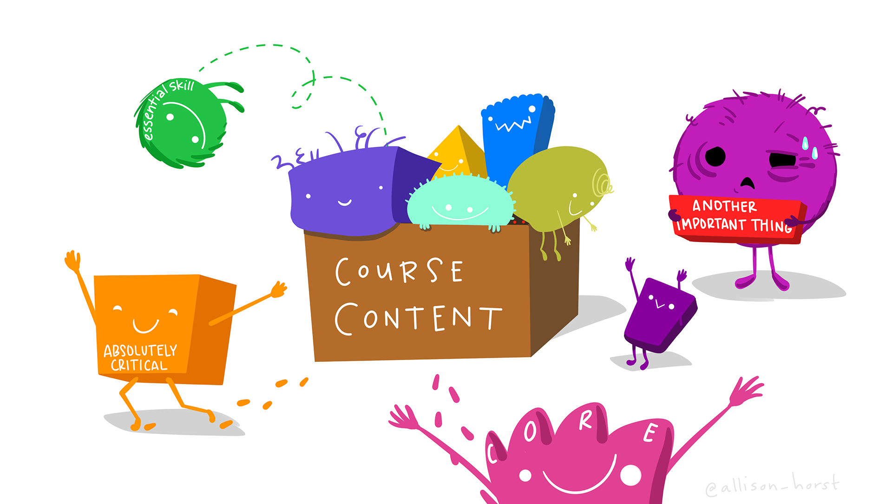

# Introducción {.unnumbered}

{fig-align="center" width="70%"}

Muchas de las herramientas empleadas en bioinformática funcionan desde la línea de comandos. Aunque al principio puede parecer intimidante, la terminal es una herramienta poderosa que facilita el análisis de datos y la automatización de tareas.

Este tutorial te guiará paso a paso por los comandos esenciales. Lo importante no es memorizarlos, sino entender qué hacen, cuándo utilizarlos y practicar con ejemplos hasta que formen parte de tu flujo de trabajo. Aquí el objetivo es dar el siguiente paso: **usar la terminal para resolver problemas reales de bioinformática**.

## ¿Qué encontrarás aquí? {.unnumbered}

El contenido está organizado en diferentes secciones que abarcan desde los fundamentos de Bash hasta herramientas ampliamente utilizadas en bioinformática.

| Sección                     | Contenido principal                                              | Propósito                                        |
|-----------------------------|------------------------------------------------------------------|--------------------------------------------------|
| Manipulación de texto       | `awk`, `sed`, `grep`, `cut`, `sort`, `uniq`, `wc`, `tr`, `paste` | Aprender a transformar y resumir texto           |
| Datos biológicos            | FASTA, FASTQ, VCF, BAM, BLAST, paired-end                        | Aplicar las herramientas a formatos reales       |
| Automatización              | `find`, `xargs`, loops, GNU `parallel`                           | Trabajar con muchos archivos y muestras          |
| `seqtk`                     | FASTA/FASTQ                                                      | Usar herramientas especializadas para secuencias |
| GFF3                        | Anotaciones                                                      | Explorar y analizar anotaciones genómicas        |
| SRA Toolkit                 | `prefetch`, `fasterq-dump`, `vdb-validate`                       | Obtener datos públicos de secuenciación          |
| E-utilities                 | `einfo`, `esearch`, `efetch`, `elink`, `xtract`                  | Consultar y navegar por NCBI                     |
| NCBI Datasets               | `datasets`, `dataformat`                                         | Descargar recursos y metadatos organizados       |
| `gget`                      | Python + CLI                                                     | Consultar recursos genómicos y realizar análisis |
| Integración de herramientas | Bash + NCBI + SRA + gget                                         | Integrar las herramientas en un flujo completo   |
| Resumen y recursos          | Referencia rápida y recursos                                     | Repasar y continuar aprendiendo                  |

::: callout-note
## Requisitos {.unnumbered}

Para aprovechar al máximo este tutorial necesitarás acceso a una terminal Bash (Linux, macOS o Ubuntu en Windows). Algunas herramientas se instalarán y explicarán en los capítulos correspondientes.
:::

::: idea
## Una idea importante {.unnumbered}

No necesitas memorizar todos los comandos. Lo importante es reconocer **qué problema quieres resolver**, elegir una herramienta apropiada y saber combinarla con otras. A lo largo del tutorial se repite una misma lógica:

**entrada → transformación → filtrado → salida**

Por ejemplo:

``` bash
cat archivo.tsv | grep "gene" | cut -f1 > genes.txt
```

Cada comando realiza una tarea pequeña y la salida de uno puede convertirse en la entrada del siguiente.
:::

## ¿Cómo leer los ejemplos? {.unnumbered}

Los bloques de código pueden contener tres tipos de elementos:

-   **comandos:** instrucciones que puedes ejecutar;
-   **comentarios:** comienzan con `#` y explican qué hace una línea;
-   **variables:** nombres como `$acc` o `$PROJECT` que permiten reutilizar valores.

Cuando veas `archivo.txt`, `sample.fastq` o `GCF_...`, normalmente se trata de un **marcador de posición** que deberás sustituir por tu archivo o accesión.

::: callout-tip
## 🔁 Patrón que se repetirá en todo el tutorial

En cada herramienta intenta responder cuatro preguntas: **¿qué entra?, ¿qué transforma?, ¿qué sale?, ¿cómo compruebo que salió bien?**. Esta pequeña rutina ayuda a evitar errores silenciosos y hace que los *pipelines* sean más reproducibles.
:::
