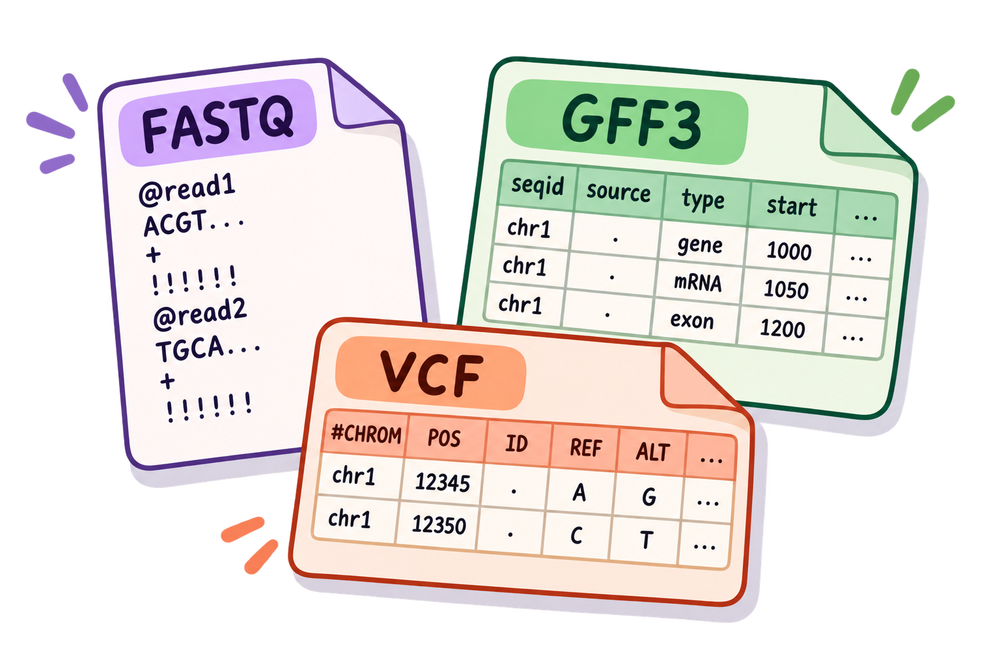

::: idea
### Cómo pasar de un comando a un problema biológico {.unnumbered}

En bioinformática, se aplica la misma lógica que en los ejemplos anteriores porque muchos formatos tienen una estructura repetitiva. La estrategia que usaremos es siempre la misma:

1.  **Identificar la estructura del archivo.** ¿Cada registro ocupa una línea o varias? ¿Dónde están las columnas importantes?
2.  **Elegir la herramienta.** ¿Necesitamos seleccionar columnas, buscar patrones, reemplazar texto o hacer cálculos?
3.  **Probar con una muestra pequeña.** Antes de procesar millones de registros, comprueba que el comando produce exactamente lo que esperas.
4.  **Convertirlo en un pipeline.** Cuando cada paso funciona, conecta las herramientas con `|` o guarda la salida en un archivo.

Esto evita uno de los errores más comunes al aprender Bash: intentar construir un comando enorme sin comprobar qué hace cada parte.
:::

Ahora que conocemos la lógica de ambas herramientas, podemos trasladarla a formatos que aparecen constantemente en bioinformática. La idea importante es que no estamos aprendiendo comandos nuevos para cada formato: estamos reutilizando las mismas operaciones sobre estructuras diferentes.

Un FASTQ, por ejemplo, no es una tabla convencional, pero tiene un patrón fijo de cuatro líneas por read. Un GFF3 sí es tabular y tiene nueve columnas. Un VCF mezcla líneas de metadatos con una tabla de variantes. Reconocer esa estructura antes de escribir un comando es parte esencial del análisis desde la terminal.

> **Regla práctica:** antes de ejecutar un *one-liner* sobre un archivo que no conoces, inspecciona primero algunas líneas con `head`, identifica el separador y determina qué representa cada columna o línea.

::: idea
## De texto a datos biológicos

Los mismos operadores que utilizamos con `file.txt` aparecen constantemente en bioinformática. La diferencia es que ahora conocemos la estructura del archivo: sabemos qué representa cada línea, cada columna o cada bloque de secuencias.

Antes de ejecutar un comando complejo, identifica siempre **qué representa una línea**, **qué representa cada columna** y, en formatos como FASTQ, **cuántas líneas forman un registro**.
:::

{fig-align="center" width="70%"}

## Manipulación de archivos FASTA / FASTQ

Los archivos FASTA y FASTQ son formatos comunes para almacenar secuencias biológicas. FASTA contiene un identificador y una o más líneas de secuencia, mientras que FASTQ añade información de calidad y organiza cada *read* en un bloque de cuatro líneas.

{fig-align="center" width="70%"}

Esta estructura permite utilizar `awk` y `sed` para realizar operaciones sencillas, como convertir entre formatos, extraer secuencias o calcular longitudes.

``` bash
# Convertir FASTQ → FASTA
sed -n '1~4s/^@/>/p; 2~4p' archivo.fq > archivo.fa

# Extraer solo las secuencias de un FASTQ (cada 4 líneas, empezando en la 2da)
sed -n '2~4p' archivo.fq

# Dividir un multi-FASTA en archivos individuales
awk '/^>/{s=++d".fa"} {print > s}' multi.fa

# Longitud de cada secuencia en un FASTA
cat file.fa | awk '$0 ~ ">" {print c; c=0; printf substr($0,2,100) "\t"; } \
              $0 !~ ">" {c += length($0);} END {print c;}'

# Calcular la longitud media de reads en FASTQ
awk 'NR%4==2 {sum += length($0)} END {print sum/(NR/4)}' input.fastq

# Extraer un read específico por nombre
zcat archivo.fastq.gz | awk 'BEGIN{RS="@"; FS="\n"}; $1~/nombreRead/{print $2; exit}'
```

En estos ejemplos, la estructura de FASTQ es especialmente importante. Como cada *read* ocupa cuatro líneas, podemos utilizar el número de línea (`NR`) para identificar qué líneas corresponden a los identificadores, las secuencias y las calidades.

Por ejemplo, `NR%4==2` selecciona las líneas que contienen las secuencias. Esto permite calcular directamente la longitud de cada *read* sin tener que procesar las líneas de calidad.

{fig-align="center" width="50%"}

## Manipulación de VCF y BAM

Los archivos VCF y BAM contienen información diferente y requieren conocer su estructura antes de procesarlos.

Un archivo VCF almacena variantes en registros tabulares, mientras que un archivo BAM contiene alineamientos de secuencias en formato binario. Por esta razón, algunas operaciones requieren convertir primero el BAM a un formato de texto o utilizar herramientas especializadas, como `samtools` y `bcftools`, junto con `awk`.

``` bash
# Convertir VCF → BED
sed -e 's/chr//' file.vcf | awk '{OFS="\t"; if (!/^#/) {print $1, $2-1, $2, $4"/"$5, "+"}}'

# Convertir BAM → FASTQ (usando samtools + awk)
samtools view archivo.bam | \
  awk 'BEGIN {FS="\t"} {print "@" $1 "\n" $10 "\n+\n" $11}' > archivo.fq

# Filtrar variantes en Chr1 entre 1Mb y 2Mb
cat file.txt | awk '$1=="1"' | awk '$3>=1000000' | awk '$3<=2000000'

# Contar muestras con datos faltantes en VCF (bcftools + awk)
bcftools query -f '[%GT\t]\n' archivo.bcf | \
  awk '{miss=0}; {for (x=1; x<=NF; x++) if ($x=="./.") {miss+=1}}; {print miss}' > nmiss.count
```

En el primer ejemplo se combinan `sed` y `awk`: `sed` elimina el prefijo `chr` y `awk` selecciona los registros de variantes y reorganiza la información para generar una salida compatible con BED.

El segundo ejemplo muestra cómo pueden combinarse herramientas especializadas con comandos de Bash. `samtools view` convierte el contenido del BAM en registros de texto que `awk` puede procesar para construir un archivo FASTQ.

Estos ejemplos muestran una idea importante: `awk` y `sed` no tienen que trabajar de manera aislada. Pueden integrarse con herramientas específicas de cada formato mediante *pipes*.


## Estadísticas básicas de reads

Una de las tareas más frecuentes al trabajar con datos de secuenciación es obtener estadísticas rápidas sobre los *reads*. Aunque existen herramientas especializadas para realizar análisis más completos, un *one-liner* puede ser útil para responder preguntas sencillas directamente desde la terminal.

El siguiente ejemplo recorre los registros de un FASTQ, cuenta los *reads* y determina cuáles aparecen una sola vez y cuál es el identificador más abundante.

``` bash
# Estadísticas de un FASTQ: total reads, únicos, más abundante
cat myfile.fq | awk '((NR-2)%4==0){
  read=$1; total++; count[read]++
} END {
  for(read in count){
    if(!max || count[read]>max) { max=count[read]; maxRead=read }
    if(count[read]==1) { unique++ }
  }
  print total, unique, unique*100/total, maxRead, count[maxRead], count[maxRead]*100/total
}'
```

El comando aprovecha nuevamente la estructura de cuatro líneas del FASTQ. La condición `((NR-2)%4==0)` permite seleccionar las líneas correspondientes a las secuencias. A partir de ellas se construye un conteo para cada *read* y, al finalizar el archivo, se calculan los valores resumidos.

## Manejo de BLAST

Los resultados de BLAST suelen almacenarse como tablas en las que cada fila representa un alineamiento entre una consulta y una secuencia de referencia. Cuando una consulta tiene varios *hits*, podemos utilizar `awk` para seleccionar o comparar resultados a partir de alguna de sus columnas.

Los siguientes ejemplos muestran cómo conservar los mejores *hits* utilizando el *bit score* como criterio.

``` bash
# Conservar solo los mejores hits (mayor bit score por query)
awk '{ if(!x[$1]++) {print $0; bitscore=($14-1)} \
       else { if($14>bitscore) print $0} }' blastout.txt

# Hits dentro de 5 puntos del mejor bit score
awk '{ if(!x[$1]++) {print $0; bitscore=($14-6)} \
       else { if($14>bitscore) print $0} }' blastout.txt
```

En ambos casos, `awk` utiliza la primera columna como identificador de la consulta y guarda información sobre el mejor *bit score* encontrado. Esto permite comparar los *hits* de una misma consulta sin tener que abrir el resultado en un programa externo.

## Interleaving de FASTQ paired-end

En la secuenciación *paired-end*, cada fragmento se representa mediante dos *reads*: uno almacenado en el archivo `R1` y otro en `R2`. Algunas herramientas requieren que ambos archivos se encuentren intercalados en un único FASTQ, alternando los *reads* de cada pareja.

En Bash podemos construir este archivo combinando herramientas como `paste`, `cut` y `tr`.

``` bash
# Intercalar dos archivos FASTQ paired-end
paste <(paste - - - - < reads-1.fastq) \
      <(paste - - - - < reads-2.fastq) \
  | tr '\t' '\n' > reads-interleaved.fastq

# Separar un FASTQ interleaved en /1 y /2
paste - - - - - - - - < reads-int.fastq \
  | tee >(cut -f 1-4 | tr '\t' '\n' > reads-1.fastq) \
  | cut -f 5-8 | tr '\t' '\n' > reads-2.fastq
```

El comando agrupa primero cada cuatro líneas de cada FASTQ para mantener unido cada *read*. Después, `paste` combina los registros correspondientes de `R1` y `R2`, mientras que `tr` transforma los separadores utilizados por `paste` nuevamente en saltos de línea.

El resultado es un FASTQ intercalado en el que los registros de las parejas aparecen de forma alternada.

Y en el segundo ejemplo, este proceso también puede realizarse en sentido contrario. En este caso, `paste` agrupa ocho líneas para representar los dos *reads* de una pareja, y `cut` separa nuevamente los registros correspondientes a `R1` y `R2`.


Ahora, hay que practicar lo aprendido, los ejercicios combinan interpretación de formatos, selección de información y construcción de comandos. Si un ejercicio parece complejo, intenta dividir el problema en pasos pequeños antes de escribir el *one-liner* completo.

------------------------------------------------------------------------

::: panel-tabset
### Ejercicio 1

**¿Cuál comando convierte correctamente un archivo FASTQ a FASTA?**

a)  `awk 'NR%4==1 || NR%4==2' archivo.fq`\
b)  **`sed -n '1~4s/^@/>/p; 2~4p' archivo.fq > archivo.fa`**\
c)  `grep -v "^+" archivo.fq > archivo.fa`\
d)  `cut -f1,2 archivo.fq > archivo.fa`

### ✅ Solución

La respuesta es **b)**.

Un archivo FASTQ tiene **4 líneas por read**:

```         
@header     ← línea 1 (cada 4 líneas desde la 1)
SECUENCIA   ← línea 2 (cada 4 líneas desde la 2)
+           ← línea 3 (separador)
CALIDADES   ← línea 4
```

El comando `sed -n '1~4s/^@/>/p; 2~4p'` hace: - `1~4`: líneas 1, 5, 9, ... → reemplaza `@` por `>` e imprime - `2~4`: líneas 2, 6, 10, ... → imprime la secuencia tal cual
:::

------------------------------------------------------------------------

::: panel-tabset
### Ejercicio 2

Completa el comando para convertir un archivo **VCF a BED**, eliminando el prefijo "chr":

``` bash
sed -e 's/___//' file.vcf | awk '{OFS="___"; if (!/^#/) {print $1, ___-1, $2, $4"/"$5, "+"}}'
```

### ✅ Solución

``` bash
sed -e 's/chr//' file.vcf | awk '{OFS="\t"; if (!/^#/) {print $1, $2-1, $2, $4"/"$5, "+"}}'
```

**Explicación clave:** En formato BED las coordenadas son **0-based**, mientras que VCF usa coordenadas **1-based**. Por eso se resta 1 a la posición de inicio (`$2-1`).
:::

------------------------------------------------------------------------

::: panel-tabset
### Ejercicio 3

Tienes un archivo `genes.tsv` con estas columnas: `gen_id | cromosoma | inicio | fin | hebra | función`

Escribe los comandos para:

1.  Imprimir solo los genes del cromosoma 3
2.  Calcular la longitud promedio de todos los genes\
3.  Encontrar el gen más largo

### ✅ Solución

``` bash
# 1. Genes del cromosoma 3
awk '$2 == "chr3"' genes.tsv

# 2. Longitud promedio (fin - inicio)
awk 'NR>1 {len = $4 - $3; total += len} END {print "Longitud promedio:", total/(NR-1), "bp"}' genes.tsv

# 3. Gen más largo
awk 'NR>1 {len = $4 - $3; if(len > max) {max=len; gen=$1}} END {print "Gen más largo:", gen, "(" max " bp)"}' genes.tsv
```
:::
