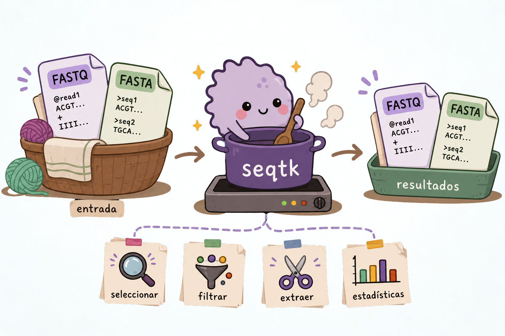

`seqtk` es una herramienta especializada para trabajar con archivos FASTA y FASTQ. Con ella podemos extraer secuencias, convertir formatos, hacer muestreos aleatorios y recortar reads.

Como `seqtk` ya conoce la estructura de estos formatos, muchas operaciones que requerirían varios comandos de Unix pueden hacerse de forma más sencilla.

En esta sección veremos algunas de las operaciones más comunes de `seqtk` y cómo utilizarlas desde la terminal.

::: idea
**Regla práctica:** si una operación implica conocer la estructura interna de FASTQ, considera primero si una herramienta especializada como `seqtk` puede hacerla de forma más clara y segura.
:::

[seqtk](https://github.com/lh3/seqtk) es una herramienta rápida para procesar archivos FASTA/FASTQ, con soporte nativo para archivos comprimidos con gzip.

{fig-align="center" width="60%"}

## Conversiones y transformaciones

`seqtk` permite convertir y modificar archivos FASTA y FASTQ de diferentes maneras. Por ejemplo, podemos convertir un FASTQ a FASTA, cambiar el formato de las líneas o generar el complemento reverso de una secuencia.

``` bash
# FASTQ → FASTA
seqtk seq -a in.fq.gz > out.fa

# FASTQ Illumina 1.3+ → FASTA, enmascarar bases con calidad < 20
seqtk seq -aQ64 -q20 in.fq > out.fa         # minúsculas
seqtk seq -aQ64 -q20 -n N in.fq > out.fa    # reemplazar con N

# Doblar líneas largas de FASTA a 60 caracteres
seqtk seq -Cl60 in.fa > out.fa

# Complemento reverso
seqtk seq -r in.fq > out.fq

# FASTQ multilínea → FASTQ de 4 líneas
seqtk seq -l0 in.fq > out.fq
```

En estos ejemplos, la opción utilizada después de `seq` determina la transformación que se realizará. Por ejemplo, `-a` convierte la salida a FASTA, mientras que `-r` genera el complemento reverso.

## Subconjuntos y extracción

Una de las ventajas de `seqtk` es que permite trabajar solo con una parte de las secuencias de un archivo. Podemos extraer reads específicos utilizando una lista de nombres, seleccionar regiones mediante un archivo BED o generar una submuestra aleatoria.

``` bash
# Extraer reads por nombre (uno por línea en name.lst)
seqtk subseq in.fq name.lst > out.fq

# Extraer secuencias por región (archivo BED)
seqtk subseq in.fa regiones.bed > out.fa

# Submuestra 10,000 pares de reads (MISMA semilla para mantener el emparejamiento)
seqtk sample -s100 read1.fq 10000 > sub1.fq
seqtk sample -s100 read2.fq 10000 > sub2.fq
```

En el caso de datos paired-end, es importante utilizar la misma semilla (`-s100`) al submuestrear ambos archivos. De esta forma, se seleccionan los mismos registros en \``read1` y `read2`, manteniendo el emparejamiento entre los reads.

::: callout-note
💡 ¿Qué es la semilla?

La semilla (seed) es un valor que se utiliza para controlar un proceso aleatorio. Usar la misma semilla permite repetir el mismo muestreo y obtener los mismos resultados.
:::

## Recorte de calidad

Los archivos FASTQ contienen información de calidad asociada a cada base. `seqtk` permite utilizar esta información para recortar bases de baja calidad de los extremos de los reads.

``` bash
# Recortar bases de baja calidad en ambos extremos (algoritmo Phred)
seqtk trimfq in.fq > out.fq

# Recortar 5bp al inicio y 10bp al final de cada read
seqtk trimfq -b 5 -e 10 in.fq > out.fq

# Enmascarar regiones en reg.bed con minúsculas
seqtk seq -M reg.bed in.fa > out.fa
```

Los dos primeros comandos utilizan `trimfq` para recortar los reads. En el segundo caso, `-b 5` indica que se eliminarán 5 bases del inicio y `-e 10` que se eliminarán 10 bases del final.

## Separación de FASTQ *interleaved*

En algunos flujos de trabajo, los reads *paired-end* se almacenan en un solo archivo FASTQ, alternando los reads de cada pareja. Este formato se conoce como interleaved FASTQ.

`seqtk` permite separar este archivo nuevamente en dos archivos, uno para cada miembro de la pareja:

``` bash
# Separar FASTQ interleaved en dos archivos
seqtk seq -l0 -1 interleaved.fq > reads_1.fq
seqtk seq -l0 -2 interleaved.fq > reads_2.fq
```

En este caso, `-1` selecciona los reads correspondientes al primer miembro de cada pareja y `-2` los del segundo.

------------------------------------------------------------------------

::: panel-tabset
### Ejercicio 1

**Tienes dos archivos FASTQ paired-end y quieres submuestrear 50,000 pares de reads. ¿Cuál comando es correcto?**

a)  

``` bash
seqtk sample read1.fq 50000 > sub1.fq
seqtk sample read2.fq 50000 > sub2.fq
```

b)  

``` bash
seqtk sample -s42 read1.fq 50000 > sub1.fq
seqtk sample -s99 read2.fq 50000 > sub2.fq
```

c)  

``` bash
seqtk sample -s42 read1.fq 50000 > sub1.fq
seqtk sample -s42 read2.fq 50000 > sub2.fq
```

d)  Ninguna de las anteriores

### ✅ Solución

La respuesta correcta es **c)**.

Es **crítico** usar la **misma semilla aleatoria** (`-s42`) en ambos archivos para garantizar que los pares de reads se mantengan juntos. Si se usan semillas diferentes (opción b) o ninguna semilla (opción a), los reads del archivo 1 y 2 no corresponderán entre sí.
:::

------------------------------------------------------------------------

::: panel-tabset
### Ejercicio 2

Completa el comando para **subsampling reproducible** de un FASTQ comprimido, extrayendo el **10% de los reads**, con semilla `123`:

``` bash
# Primero contar total de reads
total=$(zcat sample.fq.gz | wc -l | awk '{print ___/___}')

# Calcular 10%
n_reads=$(echo "$total * 0.1" | ___)

# Submuestrear
seqtk sample -s___ sample.fq.gz $___ > subsample.fq
```

### ✅ Solución

``` bash
# Contar reads totales (4 líneas por read en FASTQ)
total=$(zcat sample.fq.gz | wc -l | awk '{print $1/4}')

# Calcular 10% con bc
n_reads=$(echo "$total * 0.1" | bc | awk '{printf "%d", $1}')

# Submuestrear con semilla 123
seqtk sample -s123 sample.fq.gz $n_reads > subsample.fq

echo "Total reads: $total → Subsample: $n_reads"
```
:::
