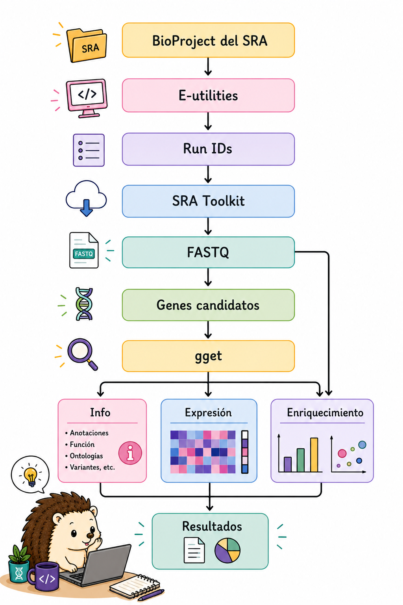
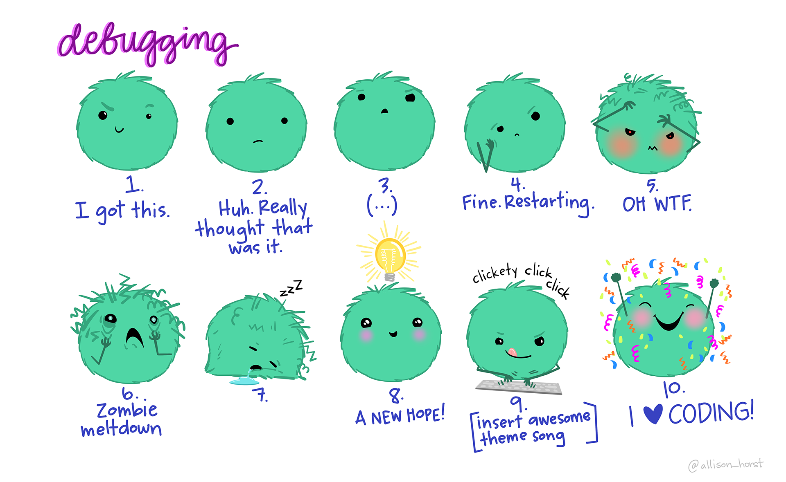

Llegaste al final del recorrido. El objetivo de este tutorial no es que memorices una lista de comandos aislados, sino que puedas reconocer patrones de trabajo y construir soluciones a partir de ellos.

En un proyecto real probablemente utilizarás solo una parte de estas herramientas, pero las mismas ideas se repiten constantemente: **inspeccionar, seleccionar, transformar, validar, automatizar y documentar**.

Un ejemplo de cómo pueden integrarse varias de estas herramientas sería:

{fig-align="center" width="70%"}

Este recorrido reúne varias de las herramientas que vimos durante el tutorial:

-   **E-utilities** para consultar información del NCBI.
-   **SRA Toolkit** para obtener los datos de secuenciación.
-   **Bash y sus herramientas** para inspeccionar y procesar los archivos.
-   **`seqtk`** para trabajar con secuencias FASTA y FASTQ.
-   **`gget`** para consultar información, secuencias, expresión y enriquecimiento desde Python.

No todos los análisis seguirán exactamente este camino. Dependiendo de la pregunta biológica y de los datos disponibles, algunas etapas pueden omitirse, cambiar de orden o requerir herramientas adicionales.

## Checklist de salida

Antes de considerar terminado un análisis desde la línea de comandos, comprueba:

-   [ ] ¿Sé cuál es el formato y la estructura de mi archivo de entrada?
-   [ ] ¿Probé cada comando con una muestra pequeña?
-   [ ] ¿La salida tiene el número y formato de registros esperado?
-   [ ] ¿Validé los archivos descargados?
-   [ ] ¿Los comandos pueden repetirse sin depender de pasos manuales ocultos?
-   [ ] ¿Guardé los comandos o el script utilizado?
-   [ ] ¿Registré errores, parámetros y versiones relevantes?
-   [ ] Si trabajé con paired-end, ¿mantuve sincronizados R1 y R2?

------------------------------------------------------------------------

:: {.callout-note}

## 🐛 ¿Y si algo sale mal?

En bioinformática, los errores forman parte del proceso. Un comando puede fallar porque el archivo no tiene la estructura que esperábamos, porque una herramienta no está instalada o simplemente porque escribimos algo diferente a lo que queríamos.

No pasa nada. Una parte importante de aprender a trabajar desde la terminal es aprender a leer los errores, revisar lo que hicimos y probar de nuevo.

Cuando algo no funcione, vuelve a lo básico:

-   ¿El archivo de entrada es el correcto?
-   ¿La estructura del archivo es la que esperaba?
-   ¿El comando está haciendo lo que creo?
-   ¿Qué parte del pipeline produjo el error?

A veces encontrar el error es también la forma de entender mejor lo que estamos haciendo.

{fig-align="center" width="70%"}

:::

## Tabla de referencia rápida

La siguiente tabla resume algunos de los comandos y herramientas que aparecen en el tutorial. Úsala como referencia rápida; para entender cómo funcionan, vuelve a la sección correspondiente

| Tarea               | Herramienta    | Comando ejemplo                                          |
|----------------|----------------|----------------------------------------|
| Extraer columnas    | `awk`          | `awk '{print $2,$5}' file.txt`                           |
| Filtrar registros   | `awk`          | `awk '$3 == "gene"' file.gff3`                           |
| Reemplazar texto    | `sed`          | `sed 's/foo/bar/g' file.txt`                             |
| Buscar patrones     | `grep`         | `grep '^>' sequences.fa`                                 |
| Ordenar datos       | `sort`         | `sort -k2,2n file.txt`                                   |
| Submuestrear reads  | `seqtk`        | `seqtk sample -s42 in.fq 10000`                          |
| Descargar SRA       | `prefetch`     | `prefetch SRR12345`                                      |
| Convertir SRA       | `fasterq-dump` | `fasterq-dump SRR12345 --threads 8`                      |
| Descargar genoma    | `datasets`     | `datasets download genome accession GCF_...`             |
| Descargar gen       | `datasets`     | `datasets download gene symbol TP53 --taxon human`       |
| Descargar batch     | `datasets`     | `datasets download genome accession --inputfile acc.txt` |
| Metadatos a TSV     | `dataformat`   | `... | dataformat tsv genome`                            |
| Buscar en NCBI      | `esearch`      | `esearch -db pubmed -query "BRCA1"`                      |
| Recuperar registros | `efetch`       | `efetch -db nucleotide -id NM_007294`                    |
| Conectar bases      | `elink`        | `elink -target protein`                                  |
| Extraer datos XML   | `xtract`       | `xtract -pattern ... -element ...`                       |
| Buscar genes        | `gget.search`  | `gget.search("TP53", "homo_sapiens")`                    |
| Obtener información | `gget.info`    | `gget.info("ENSG...")`                                   |
| Obtener secuencia   | `gget.seq`     | `gget.seq("ENSG...")`                                    |
| Explorar expresión  | `gget.archs4`  | `gget.archs4("TP53", which="tissue")`                    |
| Enriquecimiento     | `gget.enrichr` | `gget.enrichr(genes, database="ontology")`               |

## Glosario mínimo

| Término              | Significado en este tutorial                                                                                   |
|------------------------------------|------------------------------------|
| **accession**        | Identificador único de un registro o conjunto de datos en una base de datos.                                   |
| **read**             | Secuencia obtenida durante una corrida de secuenciación.                                                       |
| **paired-end**       | Estrategia en la que cada fragmento se secuencia desde ambos extremos, generando R1 y R2.                      |
| **pipeline**         | Secuencia de comandos donde la salida de un paso alimenta al siguiente.                                        |
| **metadatos**        | Información que describe una muestra, experimento, genoma o registro.                                          |
| **anotación**        | Información que identifica características biológicas sobre una secuencia.                                     |
| **reproducibilidad** | Capacidad de repetir un análisis y obtener un resultado equivalente a partir de los mismos datos y parámetros. |

## Recursos adicionales

-   📚 [Bioinformatics one-liners (Stephen Turner)](https://github.com/stephenturner/oneliners)
-   🧰 [SRA Toolkit Wiki](https://github.com/ncbi/sra-tools/wiki)
-   🗂️ [NCBI Datasets CLI --- Documentación oficial](https://www.ncbi.nlm.nih.gov/datasets/docs/v2/command-line-tools/download-and-install/)
-   🗂️ [NCBI Datasets --- Referencia de comandos](https://www.ncbi.nlm.nih.gov/datasets/docs/v2/reference-docs/command-line/datasets/)
-   🔬 [NCBI E-utilities Documentation](https://www.ncbi.nlm.nih.gov/books/NBK25498/)
-   🐍 [gget Documentation](https://github.com/pachterlab/gget)
-   📖 [seqtk GitHub](https://github.com/lh3/seqtk)
-   🔧 [GNU parallel Tutorial](https://www.gnu.org/software/parallel/parallel_tutorial.html)

::: callout-tip
## 💡 Consejos finales

1.  **Siempre valida** los archivos descargados antes de procesarlos (`vdb-validate`, `md5sum`)
2.  **Usa semillas reproducibles** (`-s42`) en cualquier operación de submuestreo
3.  **Agrega `--dry-run`** antes de ejecutar comandos destructivos en paralelo
4.  **Registra tu API key** de NCBI para obtener mayor velocidad con E-utilities
5.  **Usa `--inputfile`** en NCBI Datasets para descargas batch reproducibles desde un archivo de texto
6.  **Prefiere WSL** sobre PowerShell nativo en Windows para mayor compatibilidad con scripts bash
7.  **Documenta tus pipelines** con comentarios y guarda los logs de cada paso
:::

------------------------------------------------------------------------

*Tutorial generado con [Quarto](https://quarto.org/) · Bioinformática*
